---
## Front matter
lang: ru-RU
title: "Лабораторная работа №1. Установка и конфигурация ОС на виртуальную машину"
subtitle: "Дисциплина: Информационная безопасность"
author: "Доборщук Владимир Владимирович, НФИбд-01-18"
date: "18 сентября 2021"

## Formatting
toc: false
slide_level: 2
fontsize: 12pt
mainfont: PT Serif
romanfont: PT Serif
sansfont: PT Sans
monofont: Consolas
theme: metropolis
header-includes:
 - \metroset{progressbar=frametitle,sectionpage=progressbar,numbering=fraction}
 - '\makeatletter'
 - '\beamer@ignorenonframefalse'
 - '\makeatother'
aspectratio: 169
section-titles: true

---

# Цель работы

Приобретение практических навыков установки операционной системы на виртуальную машину, настройки минимально необходимых для дальнейшей работы сервисов.

**Задачи:**

- установка VirtualBox и загрузка образа CentOS;
- конфигурация виртуальной машины для установки образа;
- установка CentOS;
- первичная конфигурация операционной системы.

# Выполнение лабораторной работы

## Настройка VirtualBox

В свойствах VirtualBox указали соответствующий путь, а также добавили в носители наш образ.

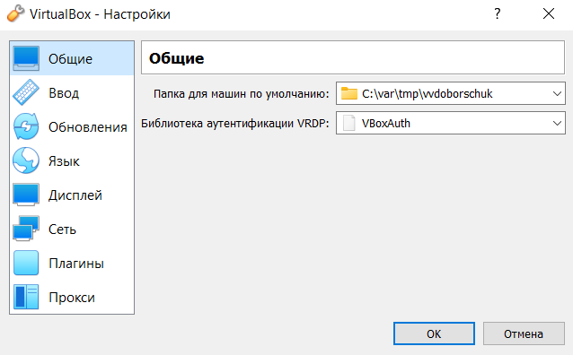{width=60%}

## Настройка VirtualBox

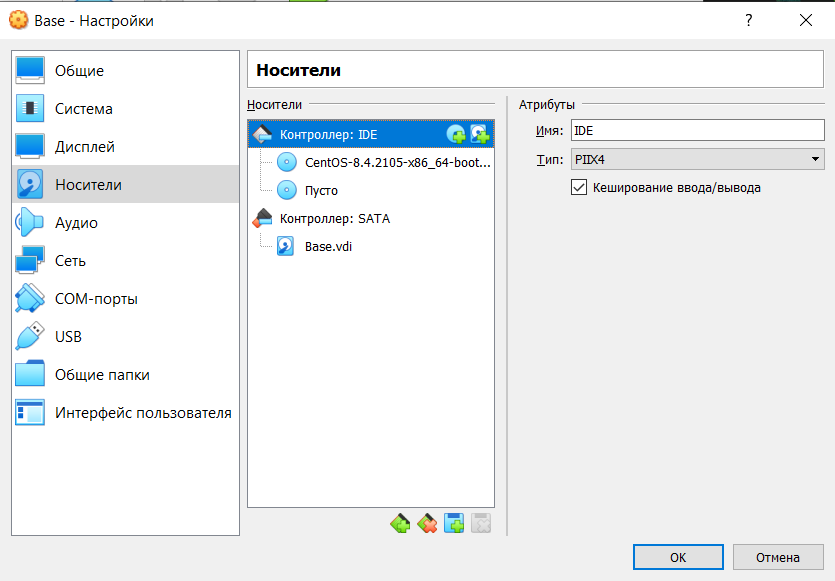{width=60%}

## Настройка VirtualBox

Далее провели конфигурацию для виртуальной машины `Base`.

{width=60%}

## Настройка VirtualBox

{width=60%}

## Установка операционной системы CentOS

После предварительной настройки VirtualBox мы приступили непосредственно к установке операционной системы. Последовательно мы выбрали:

- язык системы, 
- выбрали конкретный жесткий диск для расположения системы (перед этим совершив его полное форматирование),
- настроили подключение к сети и задали имя узла
- указали пароль для суперпользователя `root` создали собственного пользователя,
- выбрали стандартную схему установки системы с GUI.

## Установка операционной системы CentOS

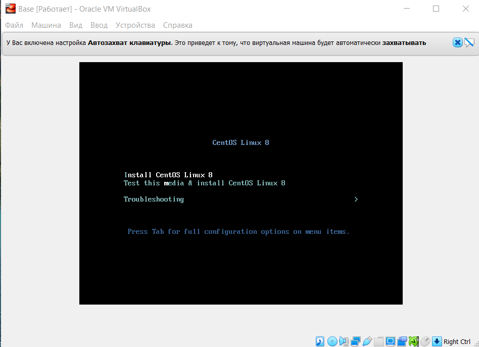{width=60%}

## Установка операционной системы CentOS

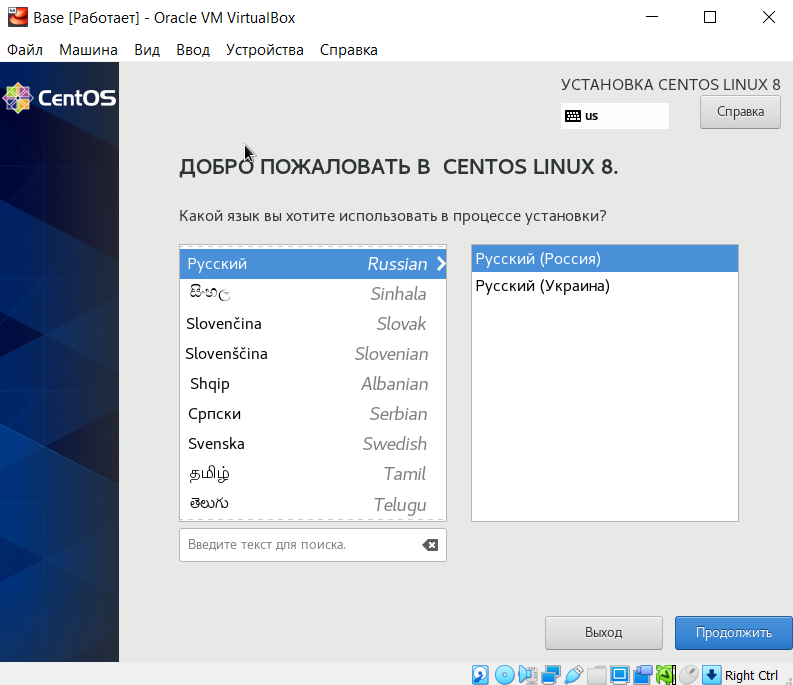{width=60%}

## Установка операционной системы CentOS

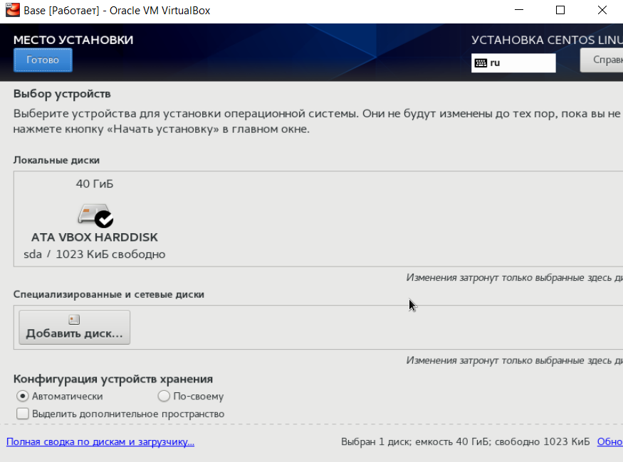{width=60%}

## Установка операционной системы CentOS

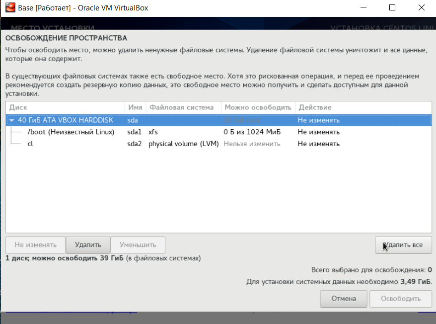{width=60%}

## Установка операционной системы CentOS

{width=60%}

## Установка операционной системы CentOS

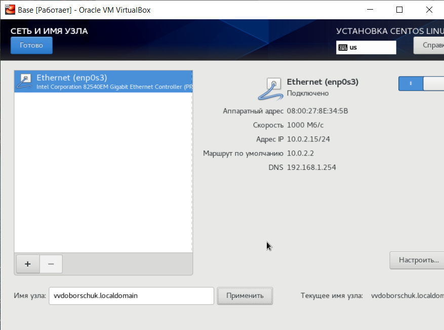{width=60%}

## Установка операционной системы CentOS

{width=60%}

## Установка операционной системы CentOS

{width=60%}

## Установка операционной системы CentOS

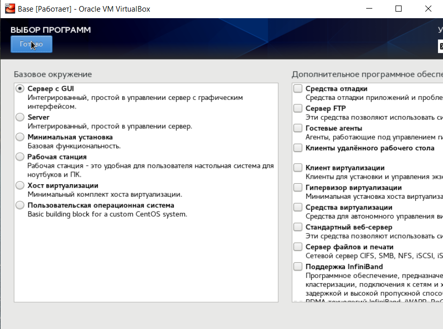{width=60%}

## Первичная конфигурация CentOS и дополнительная настройка VirtualBox

По завершении установки, перешли к первичной конфигурации и проверке работоспособности ОС.

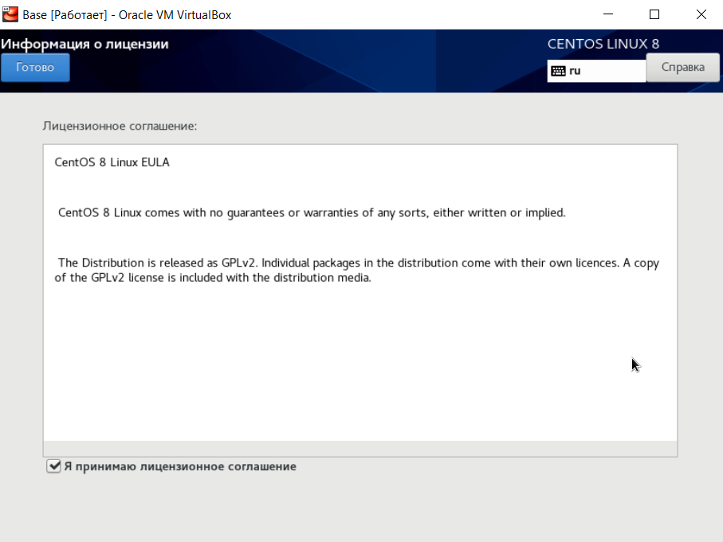{width=60%}

## Первичная конфигурация CentOS и дополнительная настройка VirtualBox

{width=60%}

## Первичная конфигурация CentOS и дополнительная настройка VirtualBox

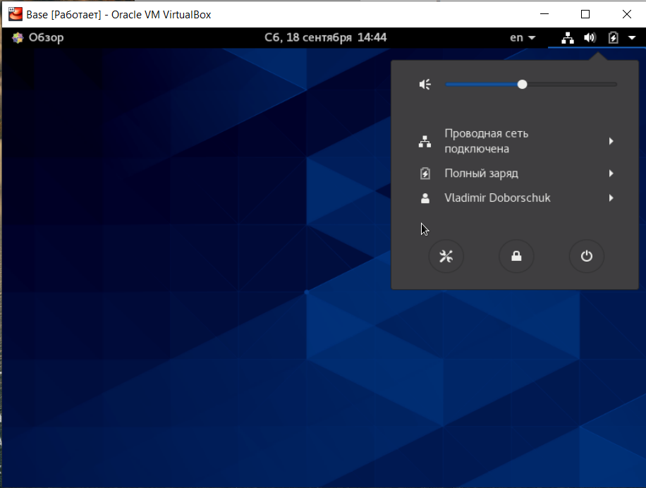{width=60%}

## Первичная конфигурация CentOS и дополнительная настройка VirtualBox

Далее, провели установку пакета `mc` с помощью `yum`.

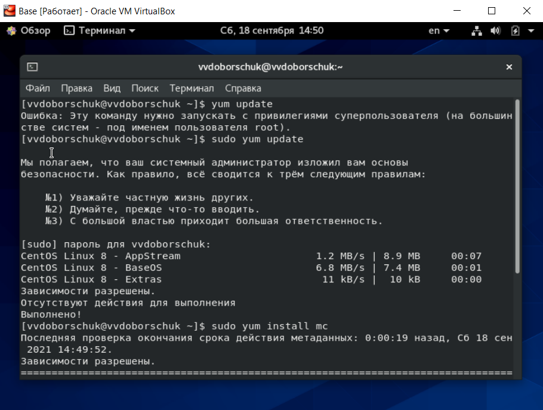{width=60%}

## Первичная конфигурация CentOS и дополнительная настройка VirtualBox

{width=60%}

## Первичная конфигурация CentOS и дополнительная настройка VirtualBox

{width=60%}

## Первичная конфигурация CentOS и дополнительная настройка VirtualBox

Установив пакет, мы выключили виртуальную машину и дополнительно сконфигурировали наш образ для множественных подключений.

{width=60%}

## Первичная конфигурация CentOS и дополнительная настройка VirtualBox

{width=60%}

# Заключение

Мы приобрели практические навыки установки операционной системы на виртуальную машину, успешно настроили минимально необходимые для дальнейшей работы сервисы.
