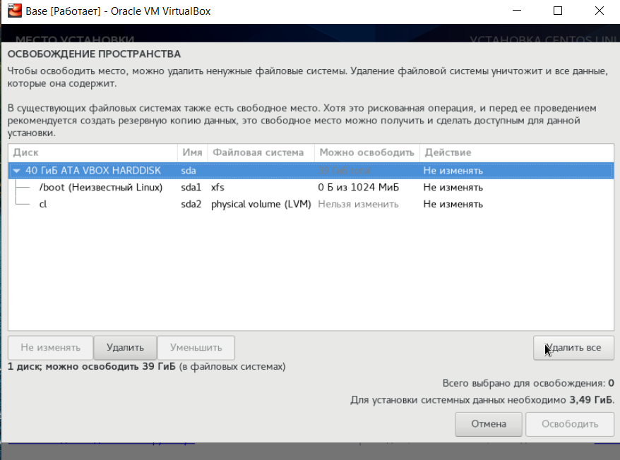
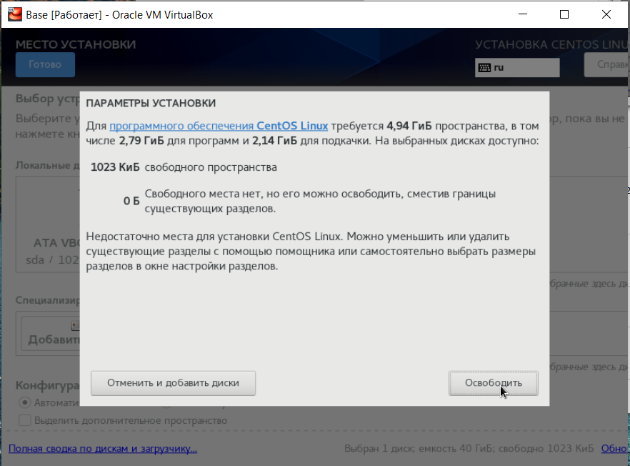
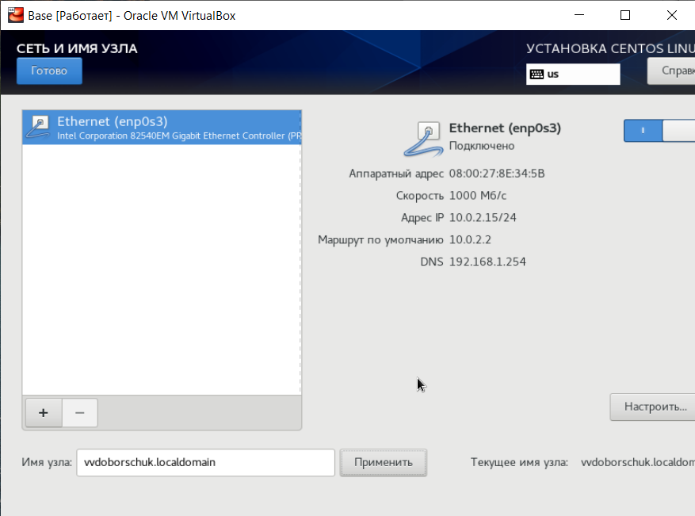
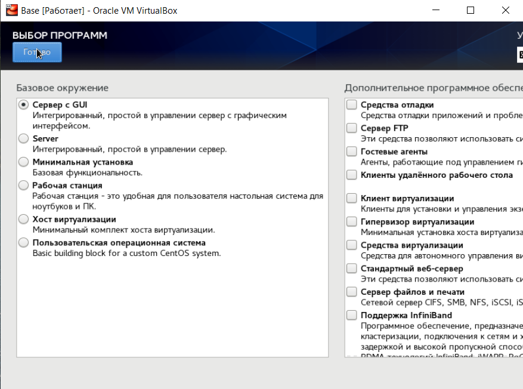

---
title: "Лабораторная работа №1. Установка и конфигурация ОС на виртуальную машину"
subtitle: "Информационная безопасность"
institute: "Российский Университет Дружбы Народов"
author: [Доборщук Владимир Владимирович, НФИбд-01-18]
date: "18 сентября 2021"
keywords: [Лабораторная]
lang: "ru"
toc-title: "Содержание"
toc: true # Table of contents
toc_depth: 2
lof: true # List of figures
fontsize: 12pt
mainfont: PT Serif
romanfont: PT Serif
sansfont: PT Sans
monofont: Consolas
mainfontoptions: Ligatures=TeX
romanfontoptions: Ligatures=TeX
sansfontoptions: Ligatures=TeX,Scale=MatchLowercase
monofontoptions: Scale=MatchLowercase
titlepage: true
titlepage-text-color: "000000"
titlepage-rule-color: "1A1B35"
titlepage-rule-height: 2
listings-no-page-break: true
indent: true
header-includes:
  - \usepackage{sectsty}
  - \sectionfont{\clearpage}
  - \linepenalty=10 # the penalty added to the badness of each line within a paragraph (no associated penalty node) Increasing the value makes tex try to have fewer lines in the paragraph.
  - \interlinepenalty=0 # value of the penalty (node) added after each line of a paragraph.
  - \hyphenpenalty=50 # the penalty for line breaking at an automatically inserted hyphen
  - \exhyphenpenalty=50 # the penalty for line breaking at an explicit hyphen
  - \binoppenalty=700 # the penalty for breaking a line at a binary operator
  - \relpenalty=500 # the penalty for breaking a line at a relation
  - \clubpenalty=150 # extra penalty for breaking after first line of a paragraph
  - \widowpenalty=150 # extra penalty for breaking before last line of a paragraph
  - \displaywidowpenalty=50 # extra penalty for breaking before last line before a display math
  - \brokenpenalty=100 # extra penalty for page breaking after a hyphenated line
  - \predisplaypenalty=10000 # penalty for breaking before a display
  - \postdisplaypenalty=0 # penalty for breaking after a display
  - \floatingpenalty = 20000 # penalty for splitting an insertion (can only be split footnote in standard LaTeX)
  - \raggedbottom # or \flushbottom
  - \usepackage{float} # keep figures where there are in the text
  - \floatplacement{figure}{H} # keep figures where there are in the text
...

# Цель работы

Приобретение практических навыков установки операционной системы на виртуальную машину, настройки минимально необходимых для дальнейшей работы сервисов.

**Задачи:**

- установка VirtualBox и загрузка образа CentOS;
- конфигурация виртуальной машины для установки образа;
- установка CentOS;
- первичная конфигурация операционной системы.

# Теоретическое введение

Для выполнения данной лабораторной работы не требуется какое-либо теоретическое введение, за исключением опционального ознакомления с инструкциями по установке операционной системы на виртуальную машину.

# Выполнение лабораторной работы

## 1. Настройка VirtualBox

Первоначально было необходимо создать директорию `/var/tmp/vvdoborschuk`. Поскольку основной ОС является Windows, мы расположили данную директорую в корне основного диска. В этой директории мы сохранили заранее скачанный образ CentOS.

В свойствах VirtualBox указали соответствующий путь (рис. 1), а также добавили в носители наш образ (рис. 2).

Следуя инструкции из лабораторной работы, настроили нашу виртуальную машину под именем `Base` с соответствующей конфигурацией (рис. 3), после чего удостоверились в корректности расположения папки для снимков (рис. 4).

## 2. Установка операционной системы CentOS

После предварительной настройки VirtualBox мы приступили непосредственно к установке операционной системы. Последовательно мы выбрали:

- язык системы, 
- выбрали конкретный жесткий диск для расположения системы (перед этим совершив его полное форматирование),
- настроили подключение к сети и задали имя узла
- указали пароль для суперпользователя `root` создали собственного пользователя,
- выбрали стандартную схему установки системы с GUI.

На следующих изображениях поэтапно изображено каждое из описанных выше действий.

После конфигурирования устанавливаемой ОС, запустили процесс установки (рис. 14).

По завершении установки, перешли к первичной конфигурации и проверке работоспособности ОС.

## 3. Первичная конфигурация CentOS и дополнительная настройка VirtualBox

Перезагрузив виртуальную машину нам не пришлось удалять оптический привод с образом, поэтому сразу же запустилась наша система. При запуске потребовалось подтвердить лицензию (рис. 15), далее появилось окно входа в учетную запись (рис. 16) и, после ввода данных, мы успешно вошли в нашу систему (рис. 16).

Далее, провели установку пакета `mc` с помощью `yum`.

Установив пакет, мы выключили виртуальную машину и дополнительно сконфигурировали наш образ для множественных подключений.

# Заключение

Мы приобрели практические навыки установки операционной системы на виртуальную машину, успешно настроили минимально необходимые для дальнейшей работы сервисы.