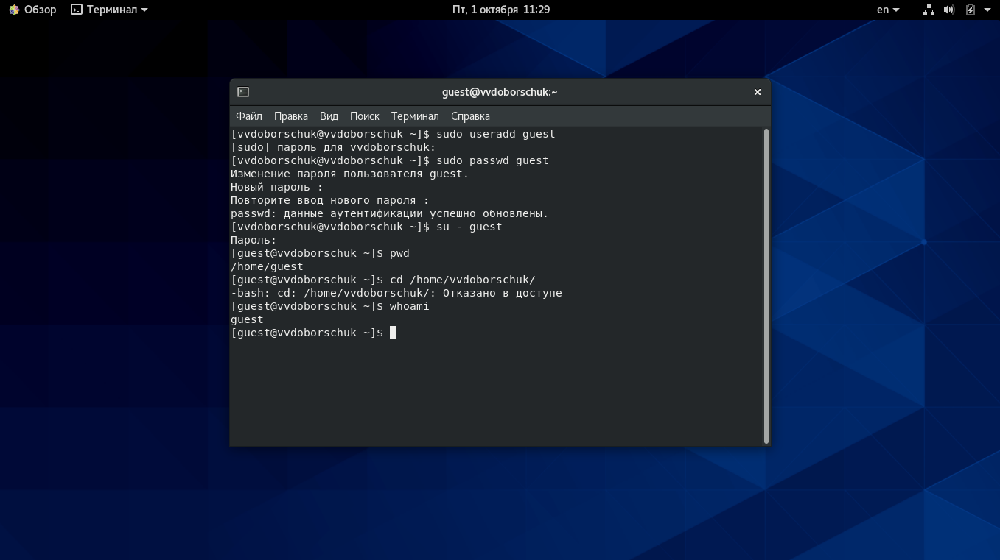
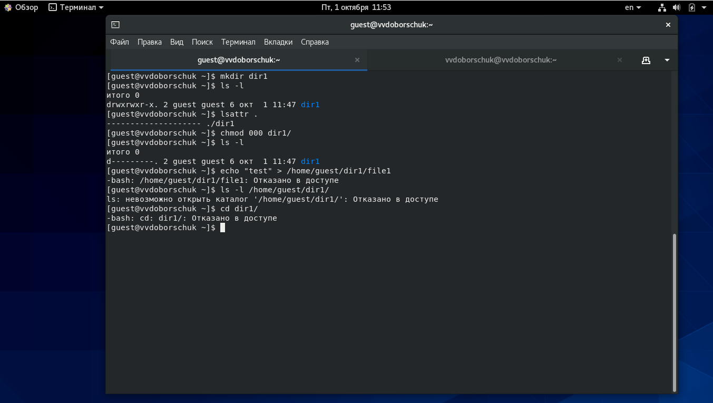
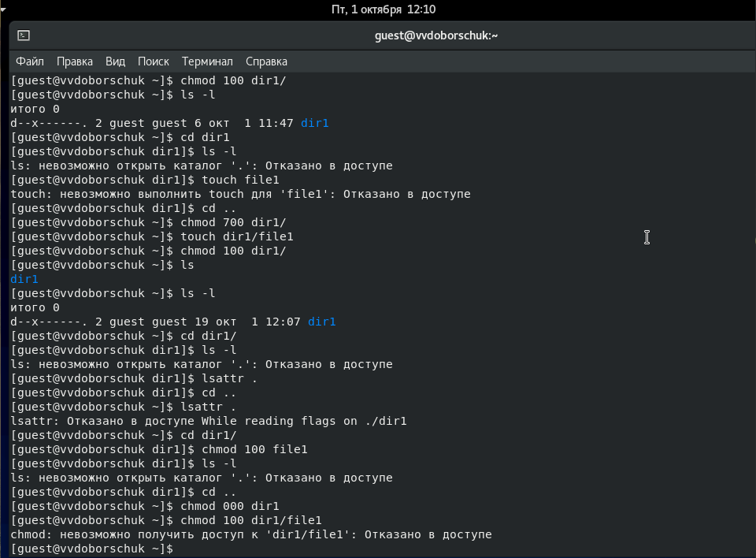
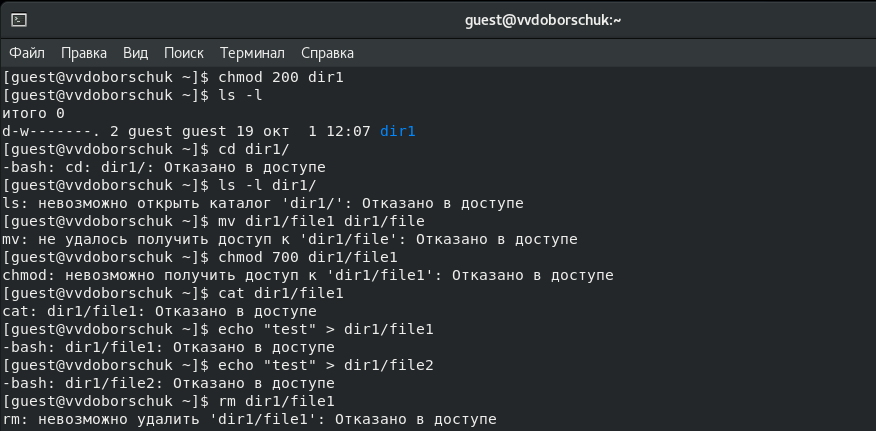
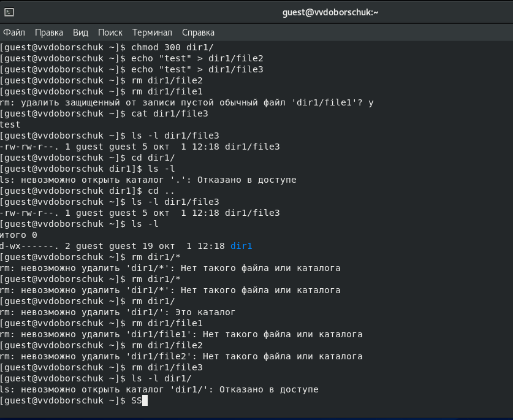
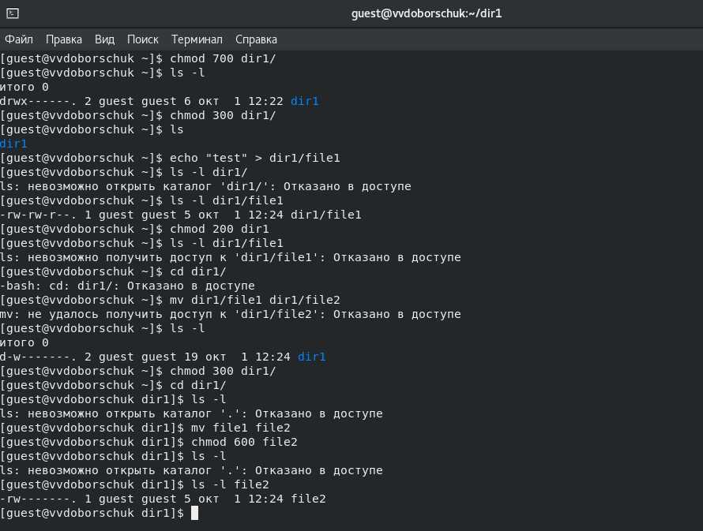
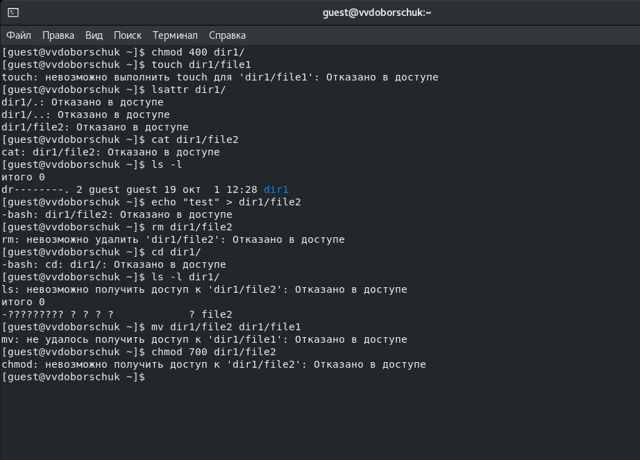
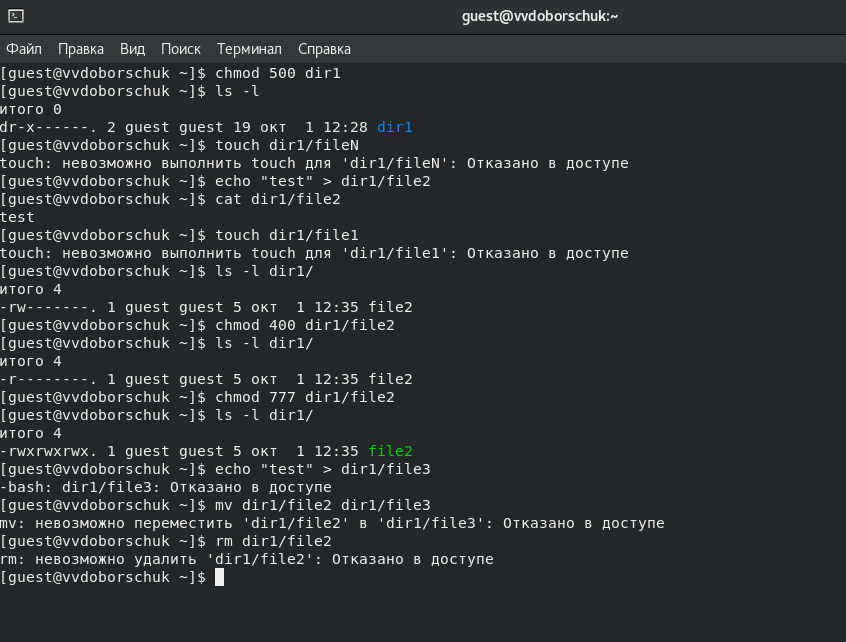
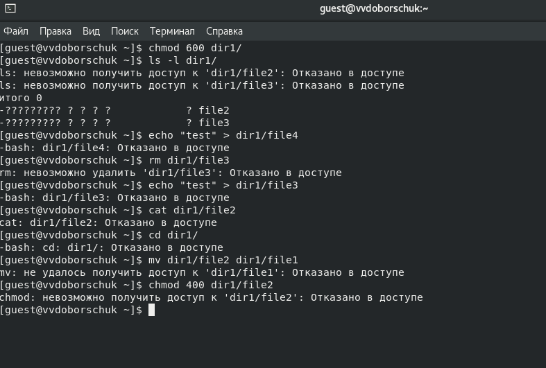

---
## Front matter
lang: ru-RU
title: "ЛР №2. Дискреционное разграничение прав в Linux. Основные атрибуты"
subtitle: "Дисциплина: Информационная безопасность"
author: "Доборщук Владимир Владимирович, НФИбд-01-18"
date: "2 октября 2021"

## Formatting
toc: false
slide_level: 2
fontsize: 12pt
mainfont: PT Serif
romanfont: PT Serif
sansfont: PT Sans
monofont: Consolas
theme: metropolis
header-includes:
 - \metroset{progressbar=frametitle,sectionpage=progressbar,numbering=fraction}
 - '\makeatletter'
 - '\beamer@ignorenonframefalse'
 - '\makeatother'
aspectratio: 169
section-titles: true

---

# Цель работы

Получение практических навыков работы в консоли с атрибутами файлов, закрепление теоретических основ дискреционного разграничения доступа в современных системах с открытым кодом на базе ОС Linux.

**Задачи:**

- анализ атрибутов директорий/файлов;
- укрепление навыков манипуляции учетными записями;
- укрепление навков взаимодействия с файловой системой.

# Выполнение лабораторной работы

## Выполнение лабораторной работы

{width=60%}

## Выполнение лабораторной работы

{width=60%}

## Выполнение лабораторной работы

{width=60%}

## Выполнение лабораторной работы

{width=60%}

## Выполнение лабораторной работы

## Выполнение лабораторной работы

{width=60%}

## Выполнение лабораторной работы

## Выполнение лабораторной работы

## Выполнение лабораторной работы

## Выполнение лабораторной работы

## Выполнение лабораторной работы

## Выполнение лабораторной работы

## Выполнение лабораторной работы

## Выполнение лабораторной работы

## Выполнение лабораторной работы

**Таблица 1. Установленные права и разрешённые действия**

Права директории | Права файла | Создание файла | Удаление файла | Запись в файл | Чтение файла | Смена директории | Просмотр файлов в директории | Переименование файла | Смена атрибутов файла |
|---|---|---|---|---|---|---|---|---|---|
`d---------` (000) | `----------` (000) | - | - | - | - | - | - | - | - |
`d--x------` (100) | `----------` (000) | - | - | - | - | + | - | - | + |
`d-w-------` (200) | `----------` (000) | - | - | - | - | - | - | - | - |
`d-wx------` (300) | `-rwx------` (700) | + | + | + | + | + | - | + | + |
`dr--------` (400) | `----------` (000) | - | - | - | - | - | + | - | - |
`dr-x------` (500) | `-rwx------` (700) | - | - | + | + | + | + | - | + |
`drw-------` (600) | `----------` (000) | - | - | - | - | - | + | - | - |
`drwx------` (700) | `-rwx------` (000) | + | + | + | + | + | + | + | + |

## Выполнение лабораторной работы

**Таблица 2. Минимальные права для совершения операция**

Операции | Минимальные права на директорию | Минимальные права на файл
|---|---|---|
Создание файла | `d-wx------` (300) | `--wx------` (300) |
Удаление файла | `d-wx------` (300) | `---x------` (100) |
Чтение файла | `d-wx------` (300) | `-r--------` (400) |
Запись в файл | `d-wx------` (300) | `-rw-------` (500) |
Переименование файла | `d-wx------` (300) | `-rw-------` (500) |
Создание поддиректории | `drwx------` (700) | `---x------` (100) |
Удаление поддиректории | `drwx------` (700) | `---x------` (100) |

# Заключение

Мы приобрели практические навыки установки операционной системы на виртуальную машину, успешно настроили минимально необходимые для дальнейшей работы сервисы.
