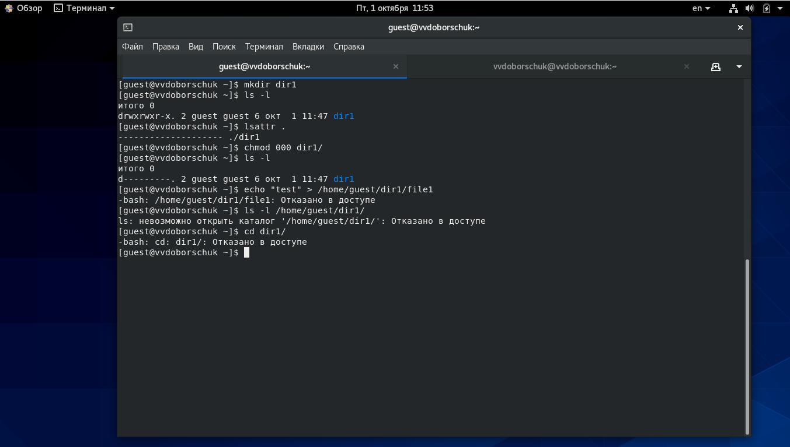
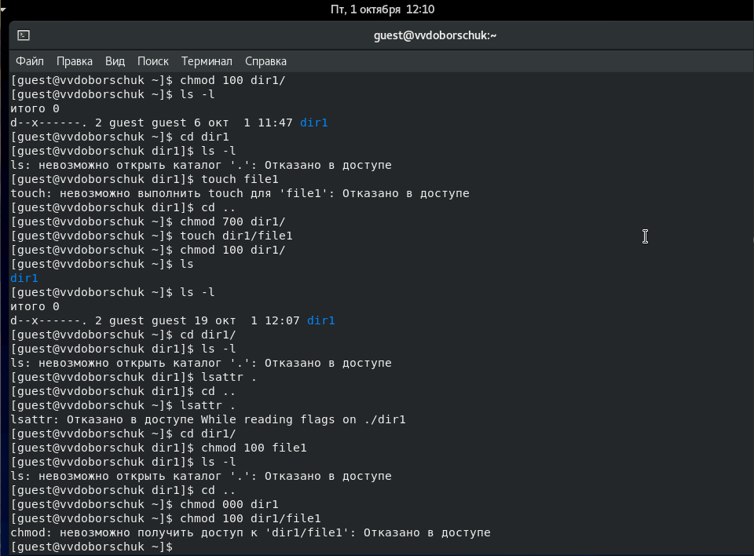
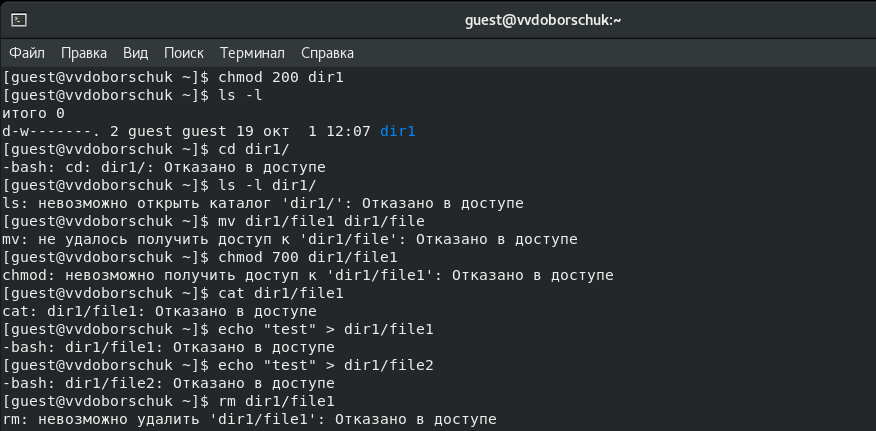
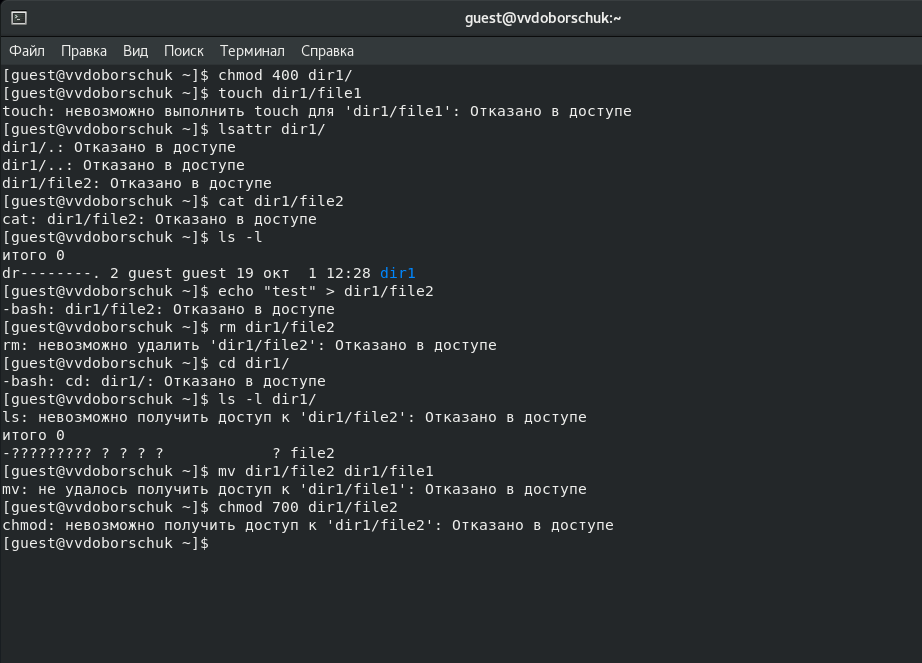
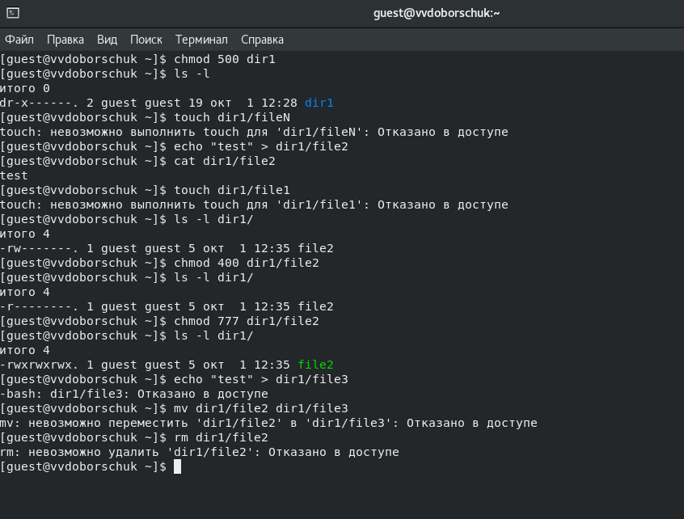

---
title: "ЛР №2. Дискреционное разграничение прав в Linux. Основные атрибуты"
subtitle: "Информационная безопасность"
institute: "Российский Университет Дружбы Народов"
author: [Доборщук Владимир Владимирович, НФИбд-01-18]
date: "2 октября 2021"
keywords: [Лабораторная]
lang: "ru"
toc-title: "Содержание"
toc: true # Table of contents
toc_depth: 2
lof: true # List of figures
fontsize: 12pt
mainfont: PT Serif
romanfont: PT Serif
sansfont: PT Sans
monofont: Consolas
mainfontoptions: Ligatures=TeX
romanfontoptions: Ligatures=TeX
sansfontoptions: Ligatures=TeX,Scale=MatchLowercase
monofontoptions: Scale=MatchLowercase
titlepage: true
titlepage-text-color: "000000"
titlepage-rule-color: "1A1B35"
titlepage-rule-height: 2
listings-no-page-break: true
indent: true
header-includes:
  - \usepackage{sectsty}
  - \sectionfont{\clearpage}
  - \linepenalty=10 # the penalty added to the badness of each line within a paragraph (no associated penalty node) Increasing the value makes tex try to have fewer lines in the paragraph.
  - \interlinepenalty=0 # value of the penalty (node) added after each line of a paragraph.
  - \hyphenpenalty=50 # the penalty for line breaking at an automatically inserted hyphen
  - \exhyphenpenalty=50 # the penalty for line breaking at an explicit hyphen
  - \binoppenalty=700 # the penalty for breaking a line at a binary operator
  - \relpenalty=500 # the penalty for breaking a line at a relation
  - \clubpenalty=150 # extra penalty for breaking after first line of a paragraph
  - \widowpenalty=150 # extra penalty for breaking before last line of a paragraph
  - \displaywidowpenalty=50 # extra penalty for breaking before last line before a display math
  - \brokenpenalty=100 # extra penalty for page breaking after a hyphenated line
  - \predisplaypenalty=10000 # penalty for breaking before a display
  - \postdisplaypenalty=0 # penalty for breaking after a display
  - \floatingpenalty = 20000 # penalty for splitting an insertion (can only be split footnote in standard LaTeX)
  - \raggedbottom # or \flushbottom
  - \usepackage{float} # keep figures where there are in the text
  - \floatplacement{figure}{H} # keep figures where there are in the text
...

# Цель работы

Получение практических навыков работы в консоли с атрибутами файлов, закрепление теоретических основ дискреционного разграничения доступа в современных системах с открытым кодом на базе ОС Linux.

**Задачи:**

- анализ атрибутов директорий/файлов;
- укрепление навыков манипуляции учетными записями;
- укрепление навков взаимодействия с файловой системой.

# Теоретическое введение

Для выполнения данной лабораторной работы мы использовали данные источники, в виде описания лабораторной работы, а также свободные источники в интернете.

# Выполнение лабораторной работы

## 1. Взаимодействие с пользователем

Зайдя в терминал, мы сделали следующие вещи:

- создали учетную запись для `guest`;
- задали пароль для `guest`;
- вошли в систему от лица `guest`;
- определили домашнюю директорию для текущего пользователя;
- уточнили имя текущего пользователя.

Далее, с помощью команды `id` мы уточнили имя пользователя, его группу и группы, куда он входит. Также использовали команду `groups`, благодаря которой мы получаем также группы, в которые входит наш текущий пользователь (что также описано командой `id`).

Сравнивая это с данными изначального пользователя, видим основные различия в имени и основной группе пользователей, а также "дефолтный" пользователь входит в группу `wheel`, в отличие от пользователя `guest`.

С помощью команды `cat /etc/passwd` и фильтра `grep` получили также часть данных о наших пользователях в системе.

## 2. Работа с атрибутами

Мы попытались определить, какие директории существуют в каталоге `/home`.

Видно, что мы смогли получить список каталогов от любого из данных нам пользователей, но нам недоступны расширенные атрибуты других пользователей.

Выполнили пункты 11-13, параллельно приступив к заполнению нашей таблицы.

Мы не смогли записать файл `/home/guest/dir1/file1`, т.к. права на директорию `dir1` эквивалентны (000), что означает запрет на чтение, запись и исполняемость внутри директории. Также, файл не создался внутри директории, как показал проверка.

Перед заполнением таблицы, мы экспериментально проверили все возможные варианты атрибутов для индивидуального пользователя.

Для случая с правами (700) все достаточно очевидно, поэтому его мы не стали индивидуально рассматривать. 

**Таблица 1. Установленные права и разрешённые действия**

Права директории | Права файла | Создание файла | Удаление файла | Запись в файл | Чтение файла | Смена директории | Просмотр файлов в директории | Переименование файла | Смена атрибутов файла |
|---|---|---|---|---|---|---|---|---|---|
`d---------` (000) | `----------` (000) | - | - | - | - | - | - | - | - |
`d--x------` (100) | `----------` (000) | - | - | - | - | + | - | - | + |
`d-w-------` (200) | `----------` (000) | - | - | - | - | - | - | - | - |
`d-wx------` (300) | `-rwx------` (700) | + | + | + | + | + | - | + | + |
`dr--------` (400) | `----------` (000) | - | - | - | - | - | + | - | - |
`dr-x------` (500) | `-rwx------` (700) | - | - | + | + | + | + | - | + |
`drw-------` (600) | `----------` (000) | - | - | - | - | - | + | - | - |
`drwx------` (700) | `-rwx------` (000) | + | + | + | + | + | + | + | + |

**Таблица 2. Минимальные права для совершения операция**

Операции | Минимальные права на директорию | Минимальные права на файл
|---|---|---|
Создание файла | `d-wx------` (300) | `--wx------` (300) |
Удаление файла | `d-wx------` (300) | `---x------` (100) |
Чтение файла | `d-wx------` (300) | `-r--------` (400) |
Запись в файл | `d-wx------` (300) | `-rw-------` (500) |
Переименование файла | `d-wx------` (300) | `-rw-------` (500) |
Создание поддиректории | `drwx------` (700) | `---x------` (100) |
Удаление поддиректории | `drwx------` (700) | `---x------` (100) |

# Заключение

Мы получили практические навыки работы в консоли с атрибутами файлов, закрепили теоретические основы дискреционного разграничения доступа в современных системах с открытым кодом на базе ОС Linux.