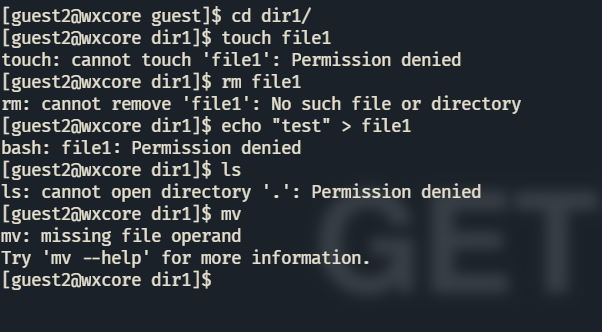
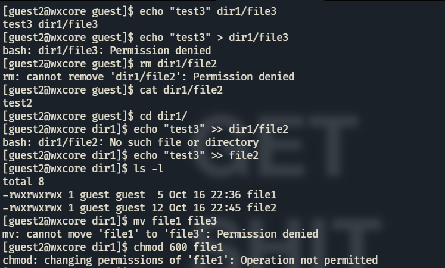

---
## Front matter
lang: ru-RU
title: "ЛР №3. Дискреционное разграничение прав в Linux. Два пользователя"
subtitle: "Дисциплина: Информационная безопасность"
author: "Доборщук Владимир Владимирович, НФИбд-01-18"
date: "16 октября 2021"

## Formatting
toc: false
slide_level: 2
fontsize: 12pt
mainfont: PT Serif
romanfont: PT Serif
sansfont: PT Sans
monofont: Consolas
theme: metropolis
header-includes:
 - \metroset{progressbar=frametitle,sectionpage=progressbar,numbering=fraction}
 - '\makeatletter'
 - '\beamer@ignorenonframefalse'
 - '\makeatother'
aspectratio: 169
section-titles: true

---

# Цель работы

Получение практических навыков работы в консоли с атрибутами файлов для групп пользователей.

**Задачи:**

- анализ атрибутов директорий/файлов от пользователя из определенной группы;
- укрепление навыков манипуляции учетными записями;
- укрепление навков взаимодействия с файловой системой.

# Выполнение лабораторной работы

Зайдя в терминал, мы сделали следующие вещи:

- создали учетную запись для `guest` и `guest2`;
- задали пароль для `guest` и `guest2`;
- вошли в систему от лица `guest` и `guest2`;
- определили домашнюю директорию для каждого пользователя;
- определили группы, к которым они принадлежат (команды `groups` и `id`).

## Выполнение лабораторной работы

{width=60%}

## Выполнение лабораторной работы

{width=60%}

## Выполнение лабораторной работы

{width=60%}

## Выполнение лабораторной работы

Видим, что пользователь `guest2` у нас также принадлежит к группе `guest`, помимо своей, которая создается при заведении пользователя. Эти же данные мы видим из файла `/etc/passwd`.

## Выполнение лабораторной работы

{width=60%}

## Выполнение лабораторной работы

От имени пользователя `guest2` выполнили регистрацию в группе `guest`.

{width=60%}

## Выполнение лабораторной работы

От имени пользователя `guest` мы дали полный набор прав на директорию `/home/guest` для групп с помощью `g+rwx`.

Также наложили ограничения на директорию `/home/guest/dir1` с помощью `chmod`.

{width=60%}

## Выполнение лабораторной работы

Очевидно, что ни одно действие внутри каталога от лица `guest2` мы сделать не сможем.

Перед заполнением таблицы, мы экспериментально проверили все возможные варианты атрибутов для индивидуального пользователя.

## Выполнение лабораторной работы

{width=60%}

## Выполнение лабораторной работы

{width=60%}

## Выполнение лабораторной работы

{width=60%}

## Выполнение лабораторной работы

{width=60%}

## Выполнение лабораторной работы

{width=60%}

## Выполнение лабораторной работы

{width=60%}

## Выполнение лабораторной работы

**Таблица 1. Установленные права и разрешённые действия**

Права директории | Права файла | Создание файла | Удаление файла | Запись в файл | Чтение файла | Смена директории | Просмотр файлов в директории | Переименование файла | Смена атрибутов файла |
|---|---|---|---|---|---|---|---|---|---|
`d---------` (000) | `----------` (000) | - | - | - | - | - | - | - | - |
`d-----x---` (010) | `----------` (000) | - | - | - | - | + | - | - | + |
`d----w----` (020) | `----------` (000) | - | - | - | - | - | - | - | - |
`d----wx---` (030) | `----rwx---` (070) | + | + | + | + | + | - | + | - |
`d---r-----` (040) | `----------` (000) | - | - | - | - | - | + | - | - |
`d---r-x---` (050) | `----rwx---` (070) | - | - | + | + | + | + | - | - |
`d---rw----` (060) | `----------` (000) | - | - | - | - | - | + | - | - |
`d---rwx---` (070) | `----rwx---` (070) | + | + | + | + | + | + | + | + |

## Выполнение лабораторной работы

**Таблица 2. Минимальные права для совершения операция**

Операции | Мин. права на директорию | Мин. права на файл
|---|---|---|
Создание файла         | `d----wx---` (030) | `-----wx---` (030) |
Удаление файла         | `d----wx---` (030) | `------x---` (010) |
Чтение файла           | `d----wx---` (030) | `----r-----` (040) |
Запись в файл          | `d----wx---` (030) | `----rw----` (050) |
Переименование файла   | `d----wx---` (030) | `----rw----` (050) |
Создание поддиректории | `d---rwx---` (070) | `------x---` (010) |
Удаление поддиректории | `d---rwx---` (070) | `------x---` (010) |

# Заключение

Мы получили практические навыки работы в консоли с атрибутами файлов для групп пользователей.