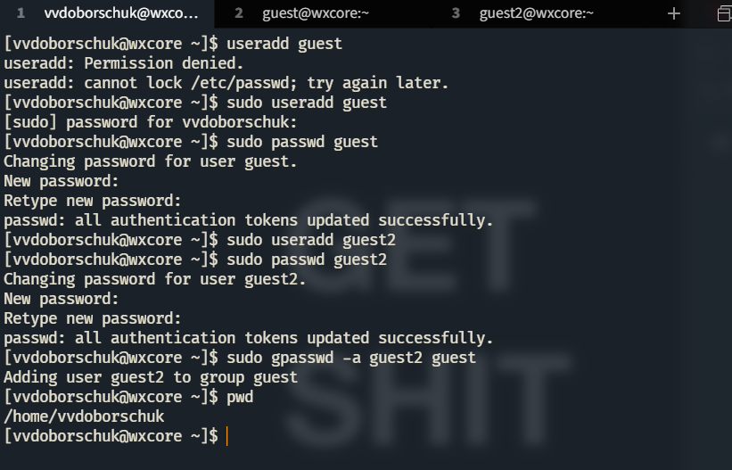
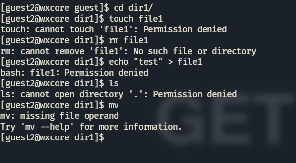
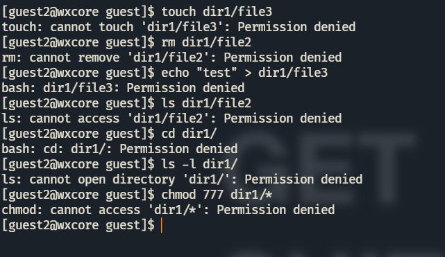
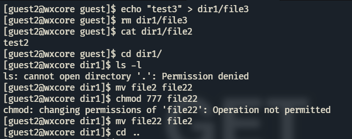
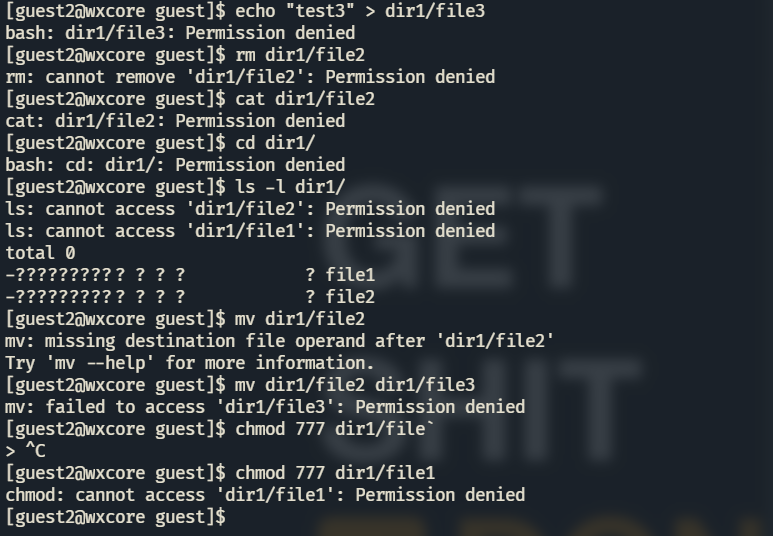
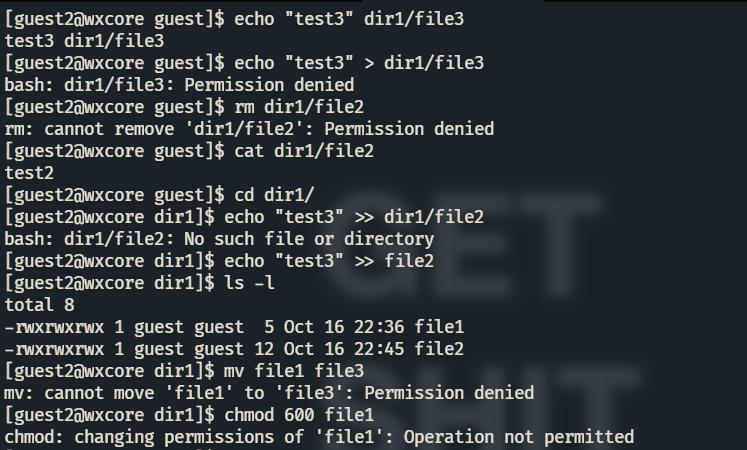
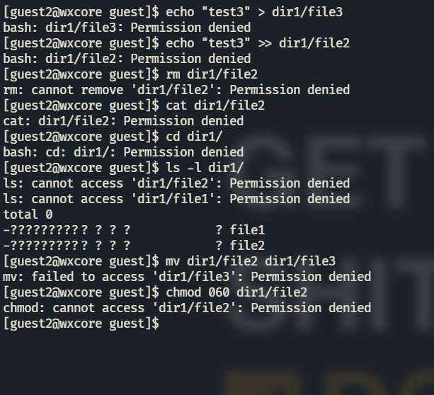

---
title: "ЛР №3. Дискреционное разграничение прав в Linux. Два пользователя"
subtitle: "Информационная безопасность"
institute: "Российский Университет Дружбы Народов"
author: [Доборщук Владимир Владимирович, НФИбд-01-18]
date: "16 октября 2021"
keywords: [Лабораторная]
lang: "ru"
toc-title: "Содержание"
toc: true # Table of contents
toc_depth: 2
lof: true # List of figures
fontsize: 12pt
mainfont: PT Serif
romanfont: PT Serif
sansfont: PT Sans
monofont: Consolas
mainfontoptions: Ligatures=TeX
romanfontoptions: Ligatures=TeX
sansfontoptions: Ligatures=TeX,Scale=MatchLowercase
monofontoptions: Scale=MatchLowercase
titlepage: true
titlepage-text-color: "000000"
titlepage-rule-color: "1A1B35"
titlepage-rule-height: 2
listings-no-page-break: true
indent: true
header-includes:
  - \usepackage{sectsty}
  - \sectionfont{\clearpage}
  - \linepenalty=10 # the penalty added to the badness of each line within a paragraph (no associated penalty node) Increasing the value makes tex try to have fewer lines in the paragraph.
  - \interlinepenalty=0 # value of the penalty (node) added after each line of a paragraph.
  - \hyphenpenalty=50 # the penalty for line breaking at an automatically inserted hyphen
  - \exhyphenpenalty=50 # the penalty for line breaking at an explicit hyphen
  - \binoppenalty=700 # the penalty for breaking a line at a binary operator
  - \relpenalty=500 # the penalty for breaking a line at a relation
  - \clubpenalty=150 # extra penalty for breaking after first line of a paragraph
  - \widowpenalty=150 # extra penalty for breaking before last line of a paragraph
  - \displaywidowpenalty=50 # extra penalty for breaking before last line before a display math
  - \brokenpenalty=100 # extra penalty for page breaking after a hyphenated line
  - \predisplaypenalty=10000 # penalty for breaking before a display
  - \postdisplaypenalty=0 # penalty for breaking after a display
  - \floatingpenalty = 20000 # penalty for splitting an insertion (can only be split footnote in standard LaTeX)
  - \raggedbottom # or \flushbottom
  - \usepackage{float} # keep figures where there are in the text
  - \floatplacement{figure}{H} # keep figures where there are in the text
...

# Цель работы

Получение практических навыков работы в консоли с атрибутами файлов для групп пользователей.

**Задачи:**

- анализ атрибутов директорий/файлов от пользователя из определенной группы;
- укрепление навыков манипуляции учетными записями;
- укрепление навков взаимодействия с файловой системой.

# Теоретическое введение

Для выполнения данной лабораторной работы мы использовали данные источники, в виде описания лабораторной работы, а также свободные источники в интернете.

# Выполнение лабораторной работы

## 1. Взаимодействие с пользователями

Зайдя в терминал, мы сделали следующие вещи:

- создали учетную запись для `guest` и `guest2`;
- задали пароль для `guest` и `guest2`;
- вошли в систему от лица `guest` и `guest2`;
- определили домашнюю директорию для каждого пользователя;
- определили группы, к которым они принадлежат (команды `groups` и `id`).

С помощью `gpasswd` мы добавили также пользователя `guest2` в группу `guest`.

Далее, определили параметры для пользователей.

Видим, что пользователь `guest2` у нас также принадлежит к группе `guest`, помимо своей, которая создается при заведении пользователя. Эти же данные мы видим из файла `/etc/passwd`.\

От имени пользователя `guest2` выполнили регистрацию в группе `guest`.

## 2. Работа с атрибутами

От имени пользователя `guest` мы дали полный набор прав на директорию `/home/guest` для групп с помощью `g+rwx`.

Также наложили ограничения на директорию `/home/guest/dir1` с помощью `chmod`.

Очевидно, что ни одно действие внутри каталога от лица `guest2` мы сделать не сможем.

Перед заполнением таблицы, мы экспериментально проверили все возможные варианты атрибутов для индивидуального пользователя.

Для случая с правами (070) все достаточно очевидно, поэтому его мы не стали индивидуально рассматривать. 

**Таблица 1. Установленные права и разрешённые действия**

Права директории | Права файла | Создание файла | Удаление файла | Запись в файл | Чтение файла | Смена директории | Просмотр файлов в директории | Переименование файла | Смена атрибутов файла |
|---       |---       |---|---|---|---|---|---|---|---|
`d---------` (000) | `----------` (000) | - | - | - | - | - | - | - | - |
`d-----x---` (010) | `----------` (000) | - | - | - | - | + | - | - | + |
`d----w----` (020) | `----------` (000) | - | - | - | - | - | - | - | - |
`d----wx---` (030) | `----rwx---` (070) | + | + | + | + | + | - | + | - |
`d---r-----` (040) | `----------` (000) | - | - | - | - | - | + | - | - |
`d---r-x---` (050) | `----rwx---` (070) | - | - | + | + | + | + | - | - |
`d---rw----` (060) | `----------` (000) | - | - | - | - | - | + | - | - |
`d---rwx---` (070) | `----rwx---` (070) | + | + | + | + | + | + | + | + |

**Таблица 2. Минимальные права для совершения операция**

Операции | Мин. права на директорию | Мин. права на файл
|---|---|---|
Создание файла         | `d----wx---` (030) | `-----wx---` (030) |
Удаление файла         | `d----wx---` (030) | `------x---` (010) |
Чтение файла           | `d----wx---` (030) | `----r-----` (040) |
Запись в файл          | `d----wx---` (030) | `----rw----` (050) |
Переименование файла   | `d----wx---` (030) | `----rw----` (050) |
Создание поддиректории | `d---rwx---` (070) | `------x---` (010) |
Удаление поддиректории | `d---rwx---` (070) | `------x---` (010) |

# Заключение

Мы получили практические навыки работы в консоли с атрибутами файлов для групп пользователей.