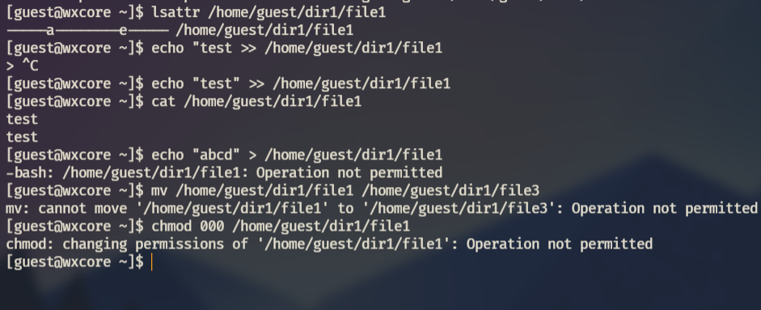
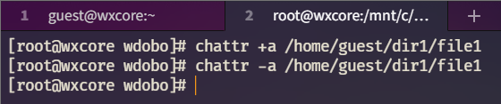

---
## Front matter
lang: ru-RU
title: "ЛР №4. Расширенные атрибуты"
subtitle: "Дисциплина: Информационная безопасность"
author: "Доборщук Владимир Владимирович, НФИбд-01-18"
date: "30 октября 2021"

## Formatting
toc: false
slide_level: 2
fontsize: 12pt
mainfont: PT Serif
romanfont: PT Serif
sansfont: PT Sans
monofont: Consolas
theme: metropolis
header-includes:
 - \metroset{progressbar=frametitle,sectionpage=progressbar,numbering=fraction}
 - '\makeatletter'
 - '\beamer@ignorenonframefalse'
 - '\makeatother'
aspectratio: 169
section-titles: true

---

# Цель работы

Получение практических навыков работы в консоли с расширенными атрибутами файлов.

**Задачи:**

- анализ расширенных атрибутов файлов;
- укрепление навыков работы в консоли;
- анализ ограничений, накладываемых на файлы/директории расширяемыми атрибутами.

# Выполнение лабораторной работы

Зайдя в терминал, мы сделали следующие вещи:

- вошли в систему от лица `guest`;
- изучили расширенные атрибуты файла `/home/guest/dir1/file1`;
- сделали попытку изменить расширенные атрибуты командой `chattr`.

## Выполнение лабораторной работы

{width=60%}

## Выполнение лабораторной работы

Наша попытка обернулась не удачей, после чего мы добавили расширенный атрибут от пользователя `root`.

{width=60%}

## Выполнение лабораторной работы

{width=60%}

## Выполнение лабораторной работы

Видим, что мы не смогли сделать ничего, кроме дозаписи в файл. Мы сняли расширенный атрибут `a` и попробовали повторить наши шаги.

{width=60%}

## Выполнение лабораторной работы

{width=60%}

## Выполнение лабораторной работы

Далее, мы выполнили такую же последовательность действие для атрибута `i`, который мы задавали командой `chattr +i /home/guest/dir1/file1` и убирали командой `chattr -i /home/guest/dir1/file1`.

{width=60%}

## Выполнение лабораторной работы

{width=60%}

С данным расширенным атрибутом мы потеряли возможность дозаписывать данные в файл.

# Заключение

В результате выполнения работы мы повысили свои навыки использования интерфейса командой строки (CLI), познакомились на примерах с тем, как используются основные и расширенные атрибуты при разграничении доступа. Имели возможность связать теорию дискреционного разделения доступа (дискреционная политика безопасности) с её реализацией на практике в ОС Linux. Составили наглядные таблицы, поясняющие какие операции возможны при тех или иных установленных правах. Опробовали действие на практике расширенных атрибутов «а» и «i».