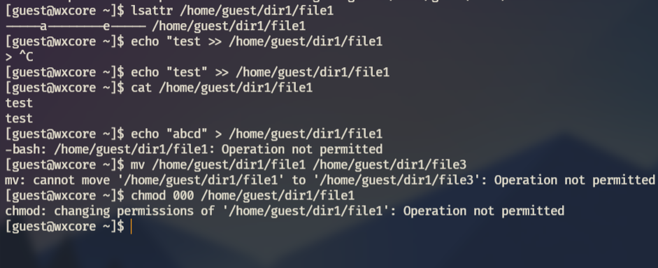
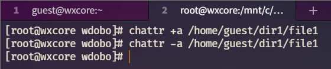

---
title: "ЛР №4. Расширенные атрибуты"
subtitle: "Информационная безопасность"
institute: "Российский Университет Дружбы Народов"
author: [Доборщук Владимир Владимирович, НФИбд-01-18]
date: "30 октября 2021"
keywords: [Лабораторная]
lang: "ru"
toc-title: "Содержание"
toc: true # Table of contents
toc_depth: 2
lof: true # List of figures
fontsize: 12pt
mainfont: PT Serif
romanfont: PT Serif
sansfont: PT Sans
monofont: Consolas
mainfontoptions: Ligatures=TeX
romanfontoptions: Ligatures=TeX
sansfontoptions: Ligatures=TeX,Scale=MatchLowercase
monofontoptions: Scale=MatchLowercase
titlepage: true
titlepage-text-color: "000000"
titlepage-rule-color: "1A1B35"
titlepage-rule-height: 2
listings-no-page-break: true
indent: true
header-includes:
  - \usepackage{sectsty}
  - \sectionfont{\clearpage}
  - \linepenalty=10 # the penalty added to the badness of each line within a paragraph (no associated penalty node) Increasing the value makes tex try to have fewer lines in the paragraph.
  - \interlinepenalty=0 # value of the penalty (node) added after each line of a paragraph.
  - \hyphenpenalty=50 # the penalty for line breaking at an automatically inserted hyphen
  - \exhyphenpenalty=50 # the penalty for line breaking at an explicit hyphen
  - \binoppenalty=700 # the penalty for breaking a line at a binary operator
  - \relpenalty=500 # the penalty for breaking a line at a relation
  - \clubpenalty=150 # extra penalty for breaking after first line of a paragraph
  - \widowpenalty=150 # extra penalty for breaking before last line of a paragraph
  - \displaywidowpenalty=50 # extra penalty for breaking before last line before a display math
  - \brokenpenalty=100 # extra penalty for page breaking after a hyphenated line
  - \predisplaypenalty=10000 # penalty for breaking before a display
  - \postdisplaypenalty=0 # penalty for breaking after a display
  - \floatingpenalty = 20000 # penalty for splitting an insertion (can only be split footnote in standard LaTeX)
  - \raggedbottom # or \flushbottom
  - \usepackage{float} # keep figures where there are in the text
  - \floatplacement{figure}{H} # keep figures where there are in the text
...

# Цель работы

Получение практических навыков работы в консоли с расширенными атрибутами файлов.

**Задачи:**

- анализ расширенных атрибутов файлов;
- укрепление навыков работы в консоли;
- анализ ограничений, накладываемых на файлы/директории расширяемыми атрибутами.

# Теоретическое введение

Для выполнения данной лабораторной работы мы использовали данные источники, в виде описания лабораторной работы, а также свободные источники в интернете.

# Выполнение лабораторной работы

## 1. Назначение расширенных атрибутов

Зайдя в терминал, мы сделали следующие вещи:

- вошли в систему от лица `guest`;
- изучили расширенные атрибуты файла `/home/guest/dir1/file1`;
- сделали попытку изменить расширенные атрибуты командой `chattr`.

Наша попытка обернулась не удачей, после чего мы добавили расширенный атрибут от пользователя `root`.

## 2. Взаимодействие с файлами при использовании расширенных атрибутов

Далее, вернулись к пользователю `guest`, увидели, что расширенные атрибуты успешно применились и от его лица попробовали выполнить:

- выполнили дозапись в файл;
- прочитали файл;
- попробовали перезаписать файл;
- попробовали переименовать файл; 
- попробовали изменить его права.

Видим, что мы не смогли сделать ничего, кроме дозаписи в файл. Мы сняли расширенный атрибут `a` и попробовали повторить наши шаги.

Далее, мы выполнили такую же последовательность действие для атрибута `i`, который мы задавали командой `chattr +i /home/guest/dir1/file1` и убирали командой `chattr -i /home/guest/dir1/file1`.

С данным расширенным атрибутом мы потеряли возможность дозаписывать данные в файл.

# Заключение

В результате выполнения работы мы повысили свои навыки использования интерфейса командой строки (CLI), познакомились на примерах с тем, как используются основные и расширенные атрибуты при разграничении доступа. Имели возможность связать теорию дискреционного разделения доступа (дискреционная политика безопасности) с её реализацией на практике в ОС Linux. Составили наглядные таблицы, поясняющие какие операции возможны при тех или иных установленных правах. Опробовали действие на практике расширенных атрибутов «а» и «i».