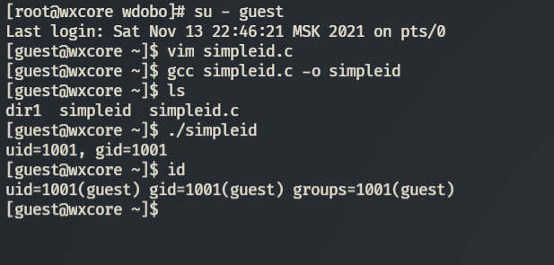
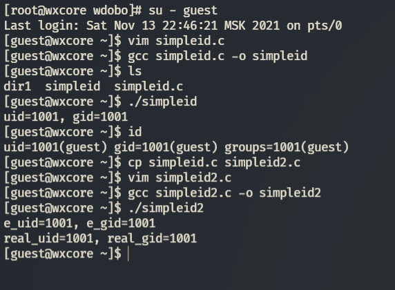
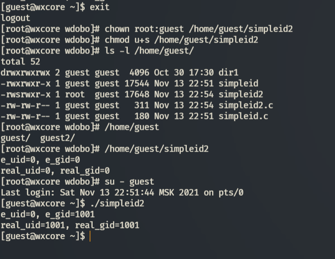
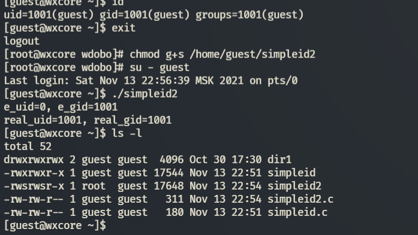
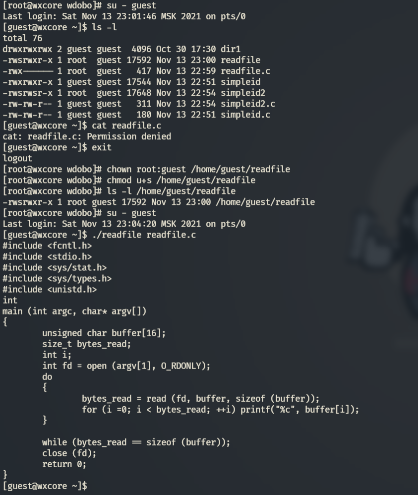
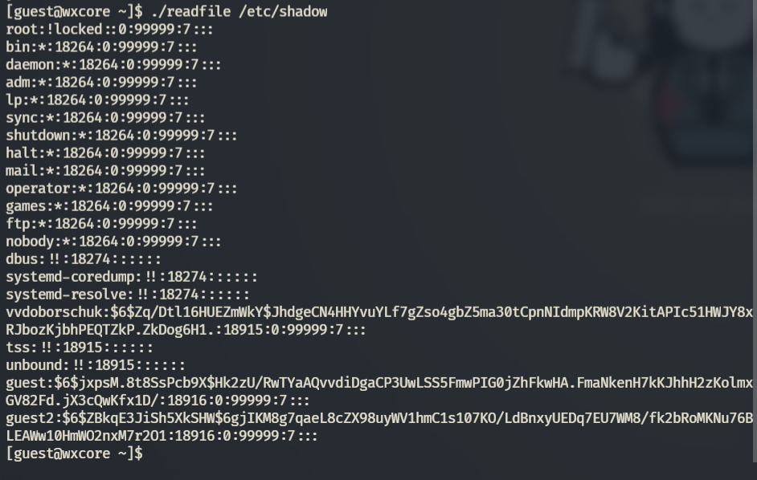
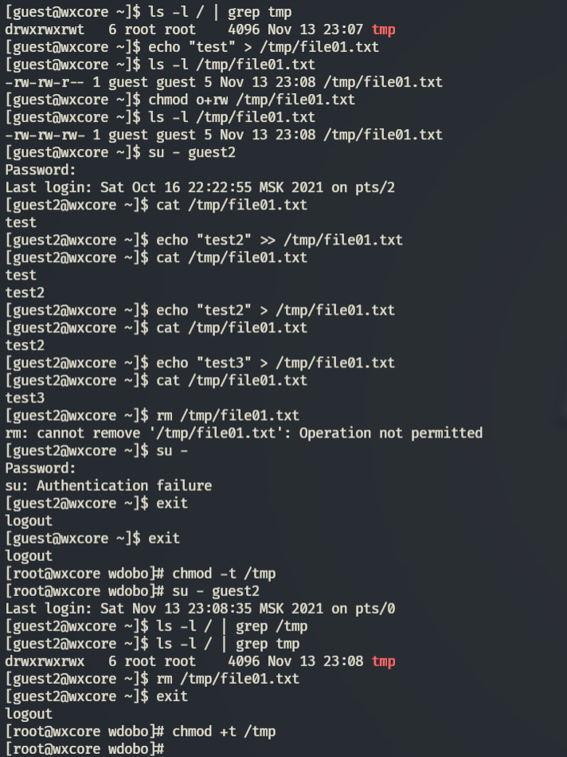

---
## Front matter
lang: ru-RU
title: "ЛР №5. Исследование влияния дополнительных атрибутов"
subtitle: "Дисциплина: Информационная безопасность"
author: "Доборщук Владимир Владимирович, НФИбд-01-18"
date: "13 ноября 2021"

## Formatting
toc: false
slide_level: 2
fontsize: 12pt
mainfont: PT Serif
romanfont: PT Serif
sansfont: PT Sans
monofont: Consolas
theme: metropolis
header-includes:
 - \metroset{progressbar=frametitle,sectionpage=progressbar,numbering=fraction}
 - '\makeatletter'
 - '\beamer@ignorenonframefalse'
 - '\makeatother'
aspectratio: 169
section-titles: true

---

# Цель работы

Изучение механизмов изменения идентификаторов, применения SetUID- и Sticky-битов. Получение практических навыков работы в консоли с дополнительными атрибутами. Рассмотрение работы механизма смены идентификатора процессов пользователей, а также влияние бита Sticky на запись и удаление файлов.

**Задачи:**

- изучить механизмы изменения идентификаторов;
- укрепление навыков работы в консоли;
- изучение влияния бита Sticky на запись и удаление файлов.

# Теоретическое введение

Для выполнения данной лабораторной работы мы использовали данные источники, в виде описания лабораторной работы, а также свободные источники в интернете.

# Выполнение лабораторной работы

## 1.  Создание программы

Зайдя в терминал, мы сделали вошли в систему от лица `guest` и реализовали следующий набор скриптов:

{width=60%}

## 1.  Создание программы

{width=60%}

## 1.  Создание программы

{width=60%}

## 1.  Создание программы

Все программы скомпилировали, последовательно выполнив пункты:

## 1.  Создание программы

{width=60%}

## 1.  Создание программы

{width=60%}

## 1.  Создание программы

{width=60%}

## 1.  Создание программы

{width=60%}

## 1.  Создание программы

{width=60%}

## 1.  Создание программы

{width=60%}

## 1.  Создание программы

Команды `sudo` и `su` позволяют использовать права суперпользователя, или же использовать его учетную запись.

Как только мы установили SetUID-бит, программа readfile получила возможность читать файлы, принадлежащие суперпользователю.

## 2. Исследование Sticky-бита

Все действия по исследованию Sticky-бита удалось поместить в один скриншот:

{width=40%}

## 2. Исследование Sticky-бита

В заключении, убрав Sticky-бит, мы смогли удалить файл чужого пользователя.

# Заключение

В результате выполнения работы мы изучили механизмы изменения идентификаторов, применения SetUID- и Sticky-битов. Получили практические навыки работы в консоли с дополнительными атрибутами. Рассмотрели работу механизма смены идентификатора процессов пользователей, а также влияние бита Sticky на запись и удаление файлов.