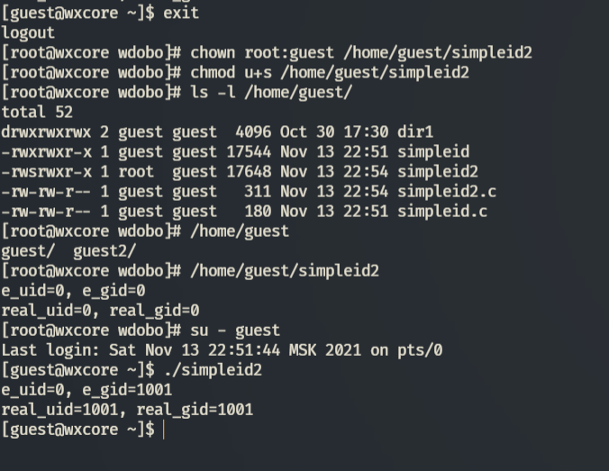

---
title: "ЛР №5. Исследование влияния дополнительных атрибутов"
subtitle: "Информационная безопасность"
institute: "Российский Университет Дружбы Народов"
author: [Доборщук Владимир Владимирович, НФИбд-01-18]
date: "13 ноября 2021"
keywords: [Лабораторная]
lang: "ru"
toc-title: "Содержание"
toc: true # Table of contents
toc_depth: 2
lof: true # List of figures
fontsize: 12pt
mainfont: PT Serif
romanfont: PT Serif
sansfont: PT Sans
monofont: Consolas
mainfontoptions: Ligatures=TeX
romanfontoptions: Ligatures=TeX
sansfontoptions: Ligatures=TeX,Scale=MatchLowercase
monofontoptions: Scale=MatchLowercase
titlepage: true
titlepage-text-color: "000000"
titlepage-rule-color: "1A1B35"
titlepage-rule-height: 2
listings-no-page-break: true
indent: true
header-includes:
  - \usepackage{sectsty}
  - \sectionfont{\clearpage}
  - \linepenalty=10 # the penalty added to the badness of each line within a paragraph (no associated penalty node) Increasing the value makes tex try to have fewer lines in the paragraph.
  - \interlinepenalty=0 # value of the penalty (node) added after each line of a paragraph.
  - \hyphenpenalty=50 # the penalty for line breaking at an automatically inserted hyphen
  - \exhyphenpenalty=50 # the penalty for line breaking at an explicit hyphen
  - \binoppenalty=700 # the penalty for breaking a line at a binary operator
  - \relpenalty=500 # the penalty for breaking a line at a relation
  - \clubpenalty=150 # extra penalty for breaking after first line of a paragraph
  - \widowpenalty=150 # extra penalty for breaking before last line of a paragraph
  - \displaywidowpenalty=50 # extra penalty for breaking before last line before a display math
  - \brokenpenalty=100 # extra penalty for page breaking after a hyphenated line
  - \predisplaypenalty=10000 # penalty for breaking before a display
  - \postdisplaypenalty=0 # penalty for breaking after a display
  - \floatingpenalty = 20000 # penalty for splitting an insertion (can only be split footnote in standard LaTeX)
  - \raggedbottom # or \flushbottom
  - \usepackage{float} # keep figures where there are in the text
  - \floatplacement{figure}{H} # keep figures where there are in the text
...

# Цель работы

Изучение механизмов изменения идентификаторов, применения SetUID- и Sticky-битов. Получение практических навыков работы в консоли с дополнительными атрибутами. Рассмотрение работы механизма смены идентификатора процессов пользователей, а также влияние бита Sticky на запись и удаление файлов.

**Задачи:**

- изучить механизмы изменения идентификаторов;
- укрепление навыков работы в консоли;
- изучение влияния бита Sticky на запись и удаление файлов.

# Теоретическое введение

Для выполнения данной лабораторной работы мы использовали данные источники, в виде описания лабораторной работы, а также свободные источники в интернете.

# Выполнение лабораторной работы

## 1.  Создание программы

Зайдя в терминал, мы сделали вошли в систему от лица `guest` и реализовали следующий набор скриптов:

Все программы скомпилировали, последовательно выполнив пункты:

Команды `sudo` и `su` позволяют использовать права суперпользователя, или же использовать его учетную запись.

Как только мы установили SetUID-бит, программа readfile получила возможность читать файлы, принадлежащие суперпользователю.

## 2. Исследование Sticky-бита

Все действия по исследованию Sticky-бита удалось поместить в один скриншот:

В заключении, убрав Sticky-бит, мы смогли удалить файл чужого пользователя.

# Заключение

В результате выполнения работы мы изучили механизмы изменения идентификаторов, применения SetUID- и Sticky-битов. Получили практические навыки работы в консоли с дополнительными атрибутами. Рассмотрели работу механизма смены идентификатора процессов пользователей, а также влияние бита Sticky на запись и удаление файлов.