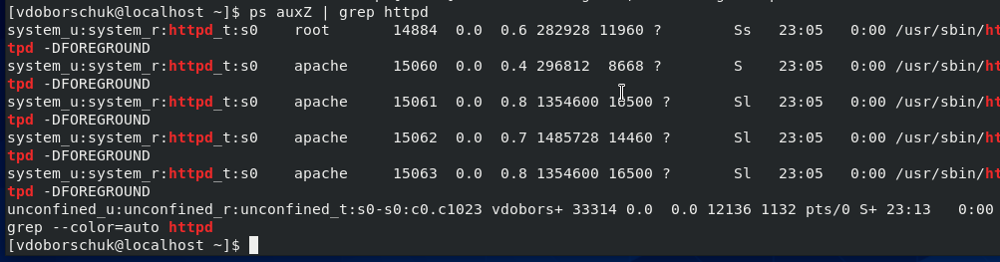
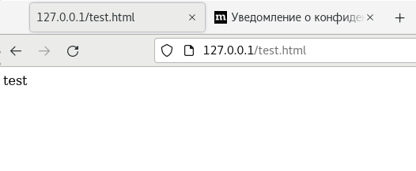
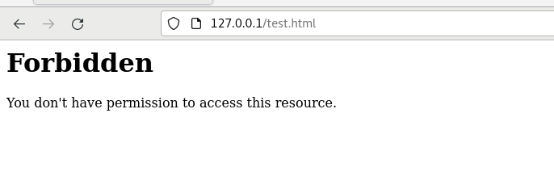
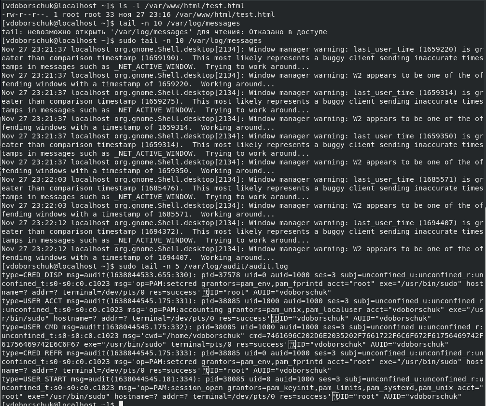
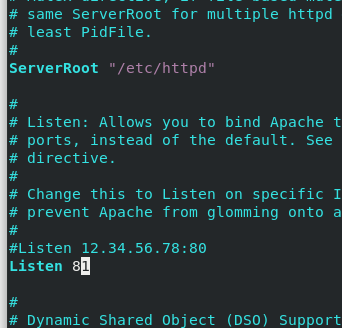
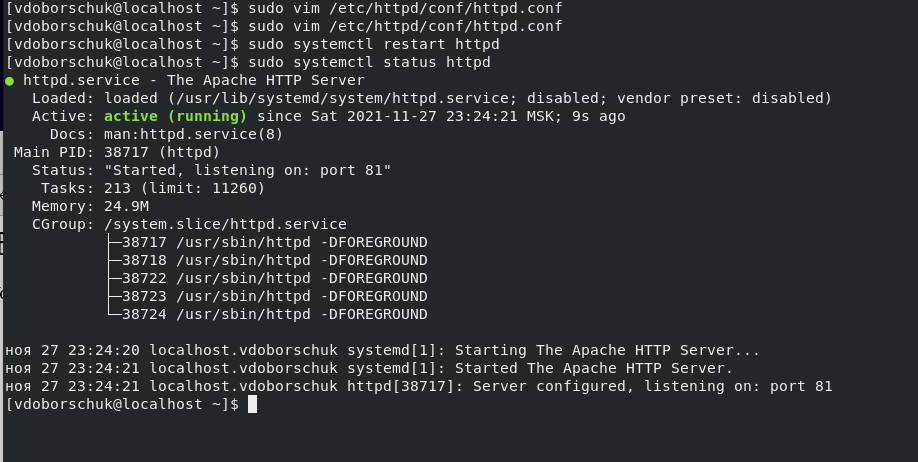
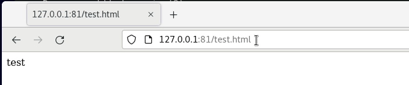
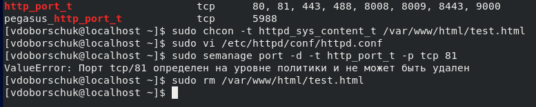

---
## Front matter
lang: ru-RU
title: "Лабораторная работа №6"
subtitle: "Мандатное разграничение прав в Linux"
author: "Доборщук В.В., НФИбд-01-18"
date: "27 ноября 2021"

## Formatting
toc: false
slide_level: 2
fontsize: 12pt
mainfont: PT Serif
romanfont: PT Serif
sansfont: PT Sans
monofont: Consolas
theme: metropolis
header-includes:
 - \metroset{progressbar=frametitle,sectionpage=progressbar,numbering=fraction}
 - '\makeatletter'
 - '\beamer@ignorenonframefalse'
 - '\makeatother'
aspectratio: 169
section-titles: true

---

# Цель работы

Развить навыки администрирования ОС Linux. Получить первое практическое знакомство с технологией SELinux. Проверить работу SELinx на практике совместно с веб-сервером Apache.

**Задачи:**

- познакомиться с SELinux;
- проверить работу с SELinux с веб-сервером Apache;

# Теоретическое введение

Для выполнения данной лабораторной работы мы использовали данные источники, в виде описания лабораторной работы, а также свободные источники в интернете.

# Выполнение лабораторной работы

Предварительно подготовили стенд и установили сервер Apache.

{width=60%}

## Выполнение лабораторной работы

{width=60%}

## Выполнение лабораторной работы

Не удалось определить текущее состояние переключателей SELinux, т.к. не поддерживается `-bigrep` аргумент.

{width=60%}

## Выполнение лабораторной работы

{width=60%}

## Выполнение лабораторной работы

Определили тип файлов директорий /var/www/...

{width=60%}

## Выполнение лабораторной работы

{width=60%}

## Выполнение лабораторной работы

{width=60%}

## Выполнение лабораторной работы

Далее не удалось изучить справку, т.к. `man` по предложенной инструкции не существует.

{width=60%}

## Выполнение лабораторной работы

{width=60%}

## Выполнение лабораторной работы

{width=60%}

## Выполнение лабораторной работы

Далее, проанализировали log-файлы, убедившись, что при таком контексте мы не сможем получить информацию из `test.html` через браузер.

{width=60%}

## Выполнение лабораторной работы

{width=60%}

## Выполнение лабораторной работы

{width=60%}

## Выполнение лабораторной работы

Нам не потребовалось проверять лог-файлы, все прошло успешно.

{width=60%}

## Выполнение лабораторной работы

{width=60%}

## Выполнение лабораторной работы

{width=60%}

# Заключение

В результате выполнения работы мы развили навыки администрирования ОС Linux. Получили первое практическое знакомство с технологией SELinux. Проверили работу SELinx на практике совместно с веб-сервером Apache.