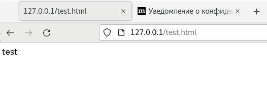
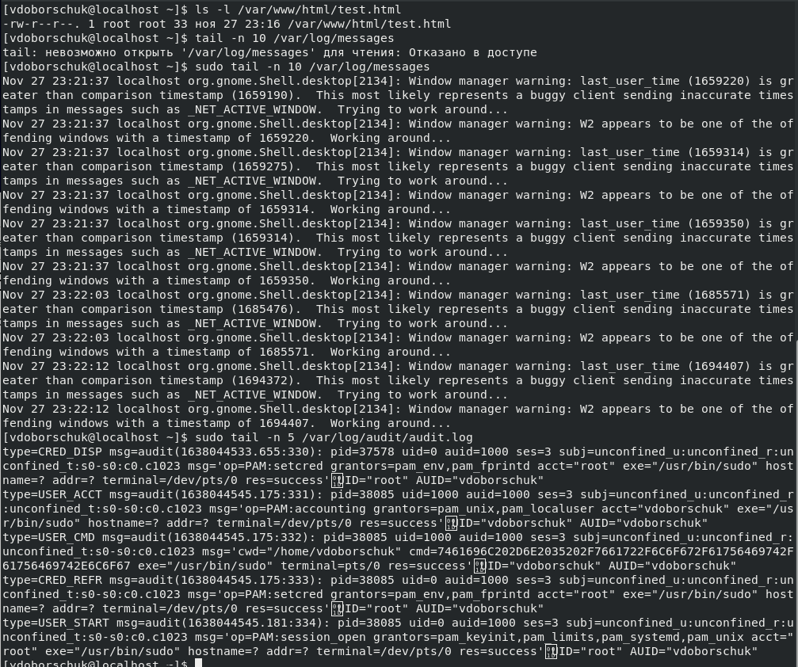
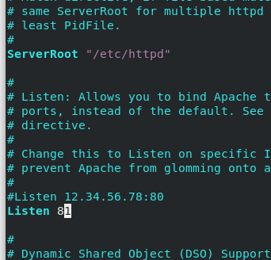
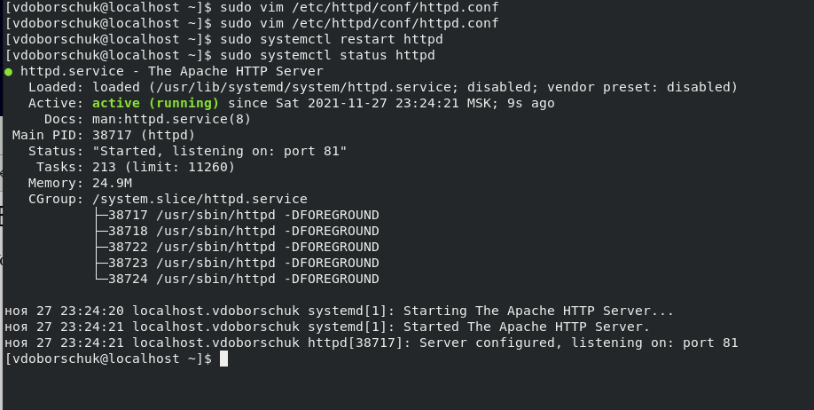

---
title: "Лабораторная работа №6"
subtitle: "Мандатное разграничение прав в Linux"
author: [Доборщук В.В., НФИбд-01-18]
date: "27 ноября 2021"
keywords: [Lab, RUDN]
lang: "ru"
toc-title: "Содержание"
toc: true # Содержание
toc_depth: 2
lof: true # Список фигур
fontsize: 12pt
mainfont: PT Serif
romanfont: PT Serif
sansfont: PT Sans
monofont: Consolas
mainfontoptions: Ligatures=TeX
romanfontoptions: Ligatures=TeX
sansfontoptions: Ligatures=TeX,Scale=MatchLowercase
monofontoptions: Scale=MatchLowercase
link-citations: true
titlepage: true
titlepage-text-color: "000000"
titlepage-rule-color: "1A1B35"
titlepage-rule-height: 2
listings-no-page-break: true
indent: true
logo: "../rudn.pdf"
logo-width: 70mm
header-includes:
  - \usepackage{sectsty}
  - \sectionfont{\clearpage}
  - \linepenalty=10 # the penalty added to the badness of each line within a paragraph (no associated penalty node) Increasing the value makes tex try to have fewer lines in the paragraph.
  - \interlinepenalty=0 # value of the penalty (node) added after each line of a paragraph.
  - \hyphenpenalty=50 # the penalty for line breaking at an automatically inserted hyphen
  - \exhyphenpenalty=50 # the penalty for line breaking at an explicit hyphen
  - \binoppenalty=700 # the penalty for breaking a line at a binary operator
  - \relpenalty=500 # the penalty for breaking a line at a relation
  - \clubpenalty=150 # extra penalty for breaking after first line of a paragraph
  - \widowpenalty=150 # extra penalty for breaking before last line of a paragraph
  - \displaywidowpenalty=50 # extra penalty for breaking before last line before a display math
  - \brokenpenalty=100 # extra penalty for page breaking after a hyphenated line
  - \predisplaypenalty=10000 # penalty for breaking before a display
  - \postdisplaypenalty=0 # penalty for breaking after a display
  - \floatingpenalty = 20000 # penalty for splitting an insertion (can only be split footnote in standard LaTeX)
  - \raggedbottom # or \flushbottom
  - \usepackage{float} # keep figures where there are in the text
  - \floatplacement{figure}{H} # keep figures where there are in the text
  - \usepackage{enumitem}
  - \usepackage{amsfonts, amssymb, amsmath, amsthm}
  - \DeclareSymbolFontAlphabet{\mathbb}{AMSb}
  - \usepackage{fontspec}
  - \usepackage{unicode-math}
  - \setlist[itemize,1]{label=$-$}
  - \setlist[itemize,2]{label=$\bullet$}
  - \usepackage{tcolorbox}
  - \newtcolorbox{info-box}{colback=cyan!5!white,arc=0pt,outer arc=0pt,colframe=cyan!60!black}
  - \newtcolorbox{warning-box}{colback=orange!5!white,arc=0pt,outer arc=0pt,colframe=orange!80!black}
  - \newtcolorbox{error-box}{colback=red!5!white,arc=0pt,outer arc=0pt,colframe=red!75!black}
pandoc-latex-environment:
  tcolorbox: [box]
  info-box: [info]
  warning-box: [warning]
  error-box: [error]
...

# Цель работы

Развить навыки администрирования ОС Linux. Получить первое практическое знакомство с технологией SELinux. Проверить работу SELinx на практике совместно с веб-сервером Apache.

**Задачи:**

- познакомиться с SELinux;
- проверить работу с SELinux с веб-сервером Apache;

# Теоретическое введение

Для выполнения данной лабораторной работы мы использовали данные источники, в виде описания лабораторной работы, а также свободные источники в интернете.

# Выполнение лабораторной работы

Предварительно подготовили стенд и установили сервер Apache.

Не удалось определить текущее состояние переключателей SELinux, т.к. не поддерживается `-bigrep` аргумент.

Определили тип файлов директорий /var/www/...

Далее не удалось изучить справку, т.к. `man` по предложенной инструкции не существует.

Далее, проанализировали log-файлы, убедившись, что при таком контексте мы не сможем получить информацию из `test.html` через браузер.

Нам не потребовалось проверять лог-файлы, все прошло успешно.

# Заключение

В результате выполнения работы мы развили навыки администрирования ОС Linux. Получили первое практическое знакомство с технологией SELinux. Проверили работу SELinx на практике совместно с веб-сервером Apache.