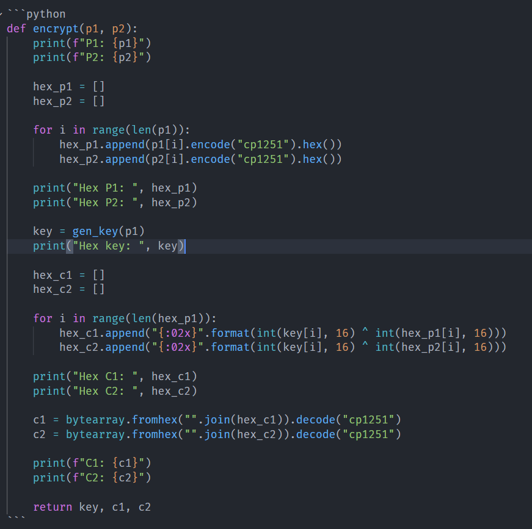
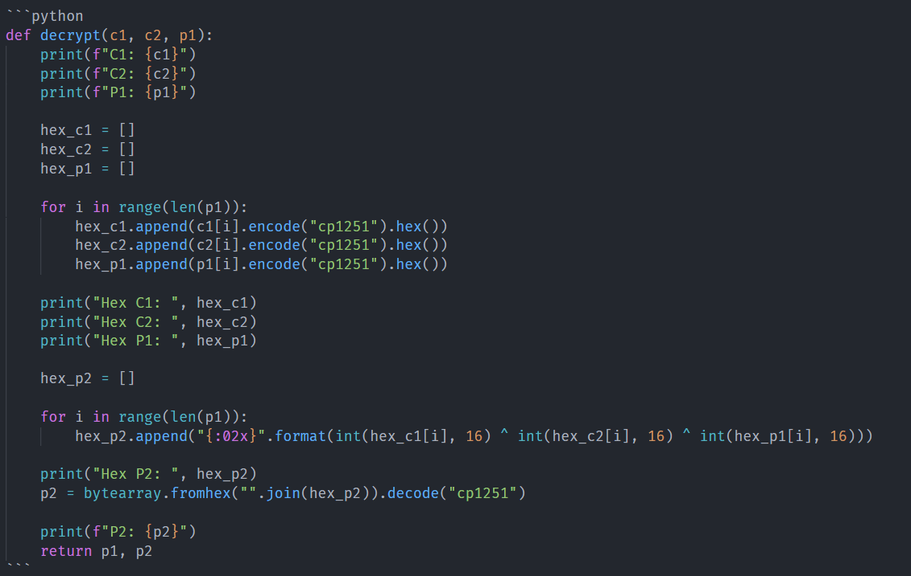
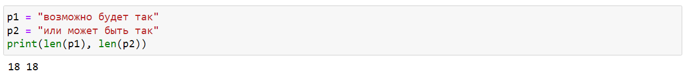
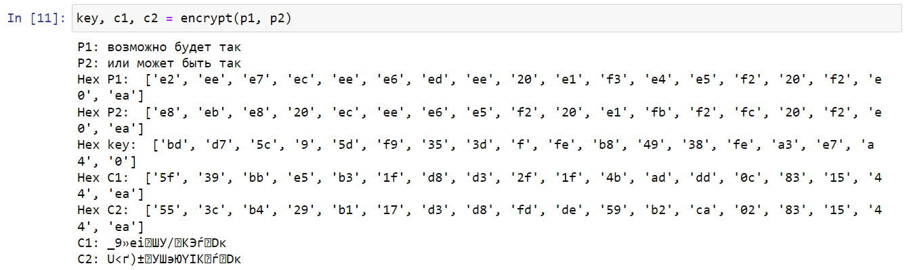
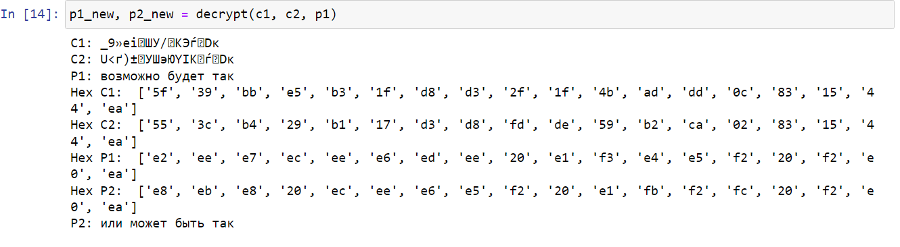

---
## Front matter
lang: ru-RU
title: "Лабораторная работа №8"
subtitle: "Шифрование (кодирование) различных исходных текстов одним ключом"
author: "Доборщук В.В., НФИбд-01-18"
date: "18 декабря 2021"

## Formatting
toc: false
slide_level: 2
fontsize: 12pt
mainfont: PT Serif
romanfont: PT Serif
sansfont: PT Sans
monofont: Consolas
theme: metropolis
header-includes:
 - \metroset{progressbar=frametitle,sectionpage=progressbar,numbering=fraction}
 - '\makeatletter'
 - '\beamer@ignorenonframefalse'
 - '\makeatother'
aspectratio: 169
section-titles: true

---

# Цель работы

Освоить на практике применение режима однократного гаммирования на примере кодирования различных исходных текстов одним ключом.

# Выполнение лабораторной работы

Два текста кодируются одним ключом (однократное гаммирование). Требуется не зная ключа и не стремясь его определить, прочитать оба текста. Необходимо разработать приложение, позволяющее шифровать и дешифровать тексты $P_1$ и $P_2$ в режиме однократного гаммирования. Приложение должно определить вид шифротекстов $C_1$ и $C_2$ обоих текстов $P_1$ и $P_2$ при известном ключе.

## Реализация функционала

Создали дополнительную функцию для генерации случайного ключа:

```python
def gen_key(text):
    rn = np.random.randint(0, 255, len(text))
    key = [hex(e)[2:] for e in rn]
    return key
```

## Реализация функционала

{width=60%}

## Реализация функционала

{width=60%}

## Проверка функционала

Создали два текста равной длины.

{width=60%}

## Проверка функционала

Попробовали, используя два исходных текста, получить два шифротекста, при случайной генерации ключа, что у нас успешно получилось.

{width=60%}

## Проверка функционала

Использовали $C_1$, $C_2$ и $P_1$ для получения $P_2$. Функция отрабатывает корректно.

{width=60%}

# Заключение

Мы освоили на практике применение режима однократного гаммирования на примере кодирования различных исходных текстов одним ключом.