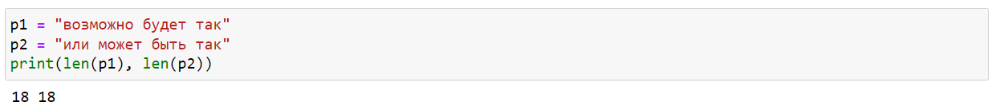
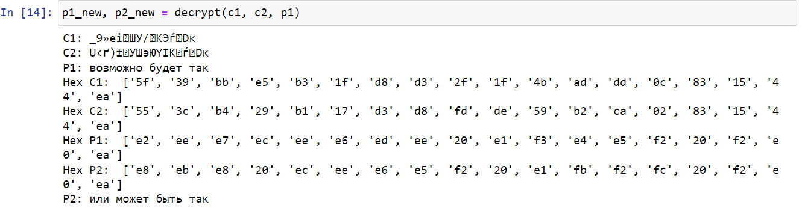

---
title: "Лабораторная работа №8"
subtitle: "Шифрование (кодирование) различных исходных текстов одним ключом"
author: [Доборщук В.В., НФИбд-01-18]
date: "18 декабря 2021"
keywords: [Lab, RUDN]
lang: "ru"
toc-title: "Содержание"
toc: true # Содержание
toc_depth: 2
lof: true # Список фигур
fontsize: 12pt
mainfont: PT Serif
romanfont: PT Serif
sansfont: PT Sans
monofont: Consolas
mainfontoptions: Ligatures=TeX
romanfontoptions: Ligatures=TeX
sansfontoptions: Ligatures=TeX,Scale=MatchLowercase
monofontoptions: Scale=MatchLowercase
link-citations: true
titlepage: true
titlepage-text-color: "000000"
titlepage-rule-color: "1A1B35"
titlepage-rule-height: 2
listings-no-page-break: true
indent: true
logo: "../rudn.pdf"
logo-width: 70mm
header-includes:
  - \usepackage{sectsty}
  - \sectionfont{\clearpage}
  - \linepenalty=10 # the penalty added to the badness of each line within a paragraph (no associated penalty node) Increasing the value makes tex try to have fewer lines in the paragraph.
  - \interlinepenalty=0 # value of the penalty (node) added after each line of a paragraph.
  - \hyphenpenalty=50 # the penalty for line breaking at an automatically inserted hyphen
  - \exhyphenpenalty=50 # the penalty for line breaking at an explicit hyphen
  - \binoppenalty=700 # the penalty for breaking a line at a binary operator
  - \relpenalty=500 # the penalty for breaking a line at a relation
  - \clubpenalty=150 # extra penalty for breaking after first line of a paragraph
  - \widowpenalty=150 # extra penalty for breaking before last line of a paragraph
  - \displaywidowpenalty=50 # extra penalty for breaking before last line before a display math
  - \brokenpenalty=100 # extra penalty for page breaking after a hyphenated line
  - \predisplaypenalty=10000 # penalty for breaking before a display
  - \postdisplaypenalty=0 # penalty for breaking after a display
  - \floatingpenalty = 20000 # penalty for splitting an insertion (can only be split footnote in standard LaTeX)
  - \raggedbottom # or \flushbottom
  - \usepackage{float} # keep figures where there are in the text
  - \floatplacement{figure}{H} # keep figures where there are in the text
  - \usepackage{enumitem}
  - \usepackage{amsfonts, amssymb, amsmath, amsthm}
  - \DeclareSymbolFontAlphabet{\mathbb}{AMSb}
  - \usepackage{fontspec}
  - \usepackage{unicode-math}
  - \setlist[itemize,1]{label=$-$}
  - \setlist[itemize,2]{label=$\bullet$}
  - \usepackage{tcolorbox}
  - \newtcolorbox{info-box}{colback=cyan!5!white,arc=0pt,outer arc=0pt,colframe=cyan!60!black}
  - \newtcolorbox{warning-box}{colback=orange!5!white,arc=0pt,outer arc=0pt,colframe=orange!80!black}
  - \newtcolorbox{error-box}{colback=red!5!white,arc=0pt,outer arc=0pt,colframe=red!75!black}
pandoc-latex-environment:
  tcolorbox: [box]
  info-box: [info]
  warning-box: [warning]
  error-box: [error]
...

# Цель работы

Освоить на практике применение режима однократного гаммирования на примере кодирования различных исходных текстов одним ключом.

# Выполнение лабораторной работы

Два текста кодируются одним ключом (однократное гаммирование). Требуется не зная ключа и не стремясь его определить, прочитать оба текста. Необходимо разработать приложение, позволяющее шифровать и дешифровать тексты $P_1$ и $P_2$ в режиме однократного гаммирования. Приложение должно определить вид шифротекстов $C_1$ и $C_2$ обоих текстов $P_1$ и $P_2$ при известном ключе.

## Теоретическое введение

Для выполнения данной лабораторной работы мы использовали данные источники, в виде описания лабораторной работы, а также свободные источники в интернете.

## Реализация функционала

Создали дополнительную функцию для генерации случайного ключа:

```python
def gen_key(text):
    rn = np.random.randint(0, 255, len(text))
    key = [hex(e)[2:] for e in rn]
    return key
```

Реализована функция для определения вида шифротекста при двух известных экземплярах открытого текста. На вход подается 2 строки равно длины, после чего они переводятся в 16-ричную систему. С их помощью получаем два зашифрованных сообщения, при случайной генерации ключа.

```python
def encrypt(p1, p2):
    print(f"P1: {p1}")
    print(f"P2: {p2}")
    
    hex_p1 = []
    hex_p2 = []
    
    for i in range(len(p1)):
        hex_p1.append(p1[i].encode("cp1251").hex())
        hex_p2.append(p2[i].encode("cp1251").hex())
    
    print("Hex P1: ", hex_p1)
    print("Hex P2: ", hex_p2)
    
    key = gen_key(p1)
    print("Hex key: ", key)
    
    hex_c1 = []
    hex_c2 = []
    
    for i in range(len(hex_p1)):
        hex_c1.append("{:02x}".format(int(key[i], 16) ^ int(hex_p1[i], 16)))
        hex_c2.append("{:02x}".format(int(key[i], 16) ^ int(hex_p2[i], 16)))
    
    print("Hex C1: ", hex_c1)
    print("Hex C2: ", hex_c2)
    
    c1 = bytearray.fromhex("".join(hex_c1)).decode("cp1251")
    c2 = bytearray.fromhex("".join(hex_c2)).decode("cp1251")
    
    print(f"C1: {c1}")
    print(f"C2: {c2}")
    
    return key, c1, c2
```

Далее, зная два шифротекста и один исходный текст, реализуем функцию для нахождения второго исходного текста без наличия ключа.

```python
def decrypt(c1, c2, p1):
    print(f"C1: {c1}")
    print(f"C2: {c2}")
    print(f"P1: {p1}")
    
    hex_c1 = []
    hex_c2 = []
    hex_p1 = []
    
    for i in range(len(p1)):
        hex_c1.append(c1[i].encode("cp1251").hex())
        hex_c2.append(c2[i].encode("cp1251").hex())
        hex_p1.append(p1[i].encode("cp1251").hex())
        
    print("Hex C1: ", hex_c1)
    print("Hex C2: ", hex_c2)
    print("Hex P1: ", hex_p1)
        
    hex_p2 = []
    
    for i in range(len(p1)):
        hex_p2.append("{:02x}".format(int(hex_c1[i], 16) ^ int(hex_c2[i], 16) ^ int(hex_p1[i], 16)))
        
    print("Hex P2: ", hex_p2)
    p2 = bytearray.fromhex("".join(hex_p2)).decode("cp1251")
    
    print(f"P2: {p2}")
    return p1, p2
```

## Проверка функционала

Создали два текста равной длины.



Попробовали, используя два исходных текста, получить два шифротекста, при случайной генерации ключа, что у нас успешно получилось.


Использовали $C_1$, $C_2$ и $P_1$ для получения $P_2$. Функция отрабатывает корректно.



# Контрольные вопросы

1. Как, зная один из текстов ($P_1$ или $P_2$), определить другой, не зная при этом
ключа?

    Для этого надо воспользоваться формулой:

    $$
    C_1 \oplus C_2 \oplus P_1 = P_1 \oplus P_2 \oplus P_1 = P_2,
    $$

    где $С_1$ и $С_2$ – шифротексты.

    Как видно, ключ в данной формуле не используется.

2. Что будет при повторном использовании ключа при шифровании текста?
   
    В таком случае мы получим исходное сообщение.

3. Как реализуется режим шифрования однократного гаммирования одним ключом двух открытых текстов?

    Он реализуется по следующей формуле:
    $$
    C_1=P_1 \oplus K
    C_2=P_2 \oplus K,
    $$

    где $С_i$ – шифротексты, $P_i$ – открытые тексты, $K$ – единый ключ шифрования.

4. Перечислите недостатки шифрования одним ключом двух открытых текстов.

    Во-первых, имея на руках одно из сообщений в открытом виде и оба шифротекста, злоумышленник способен расшифровать каждое сообщение, не зная ключа.

    Во-вторых, зная шаблон сообщений, злоумышленник получает возможность определить те символы сообщения $P_2$, которые находятся на позициях известного шаблона сообщения $P_1$.

    В соответствии с логикой сообщения $P_2$, злоумышленник имеет реальный шанс узнать ещё некоторое количество символов сообщения $P_2$. Таким образом, применяя формулу из п. 1, с подстановкой вместо $P_1$ полученных на предыдущем шаге новых символов сообщения $P_2$ злоумышленник если не прочитает оба сообщения, то значительно уменьшит пространство их поиска. Наконец, зная ключ, злоумышленник смоет расшифровать все сообщения, которые были закодированы при его помощи.

5. Перечислите преимущества шифрования одним ключом двух открытых текстов.

    Такой подход помогает упростить процесс шифрования и дешифровки. Также, при отправке сообщений между двумя компьютерами, удобнее пользоваться одним общим ключом для передаваемых данных.

# Выводы

Мы освоили на практике применение режима однократного гаммирования на примере кодирования различных исходных текстов одним ключом.